# Java Modernization powered by Application Modernization Accelerator and IBM Bob Premium Package for Java Modernization

<kbd>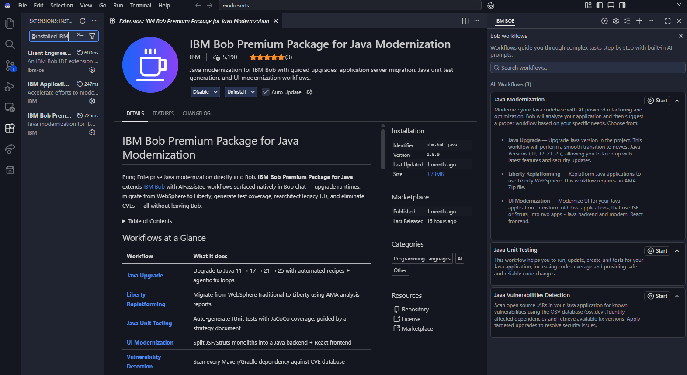</kbd>

**Last updated:** August 2026

**Status:** Under Development

**Duration:** 90 minutes

Need support? Contact **Lars Besselmann, Lars.Besselmann@de.ibm.com**

## About the lab

This lab provides end-to-end experience how to modernize an old Java Enterprise Application to Liberty. 
First, you will use Application Modernization Accelerator (AMA) to assess the application, then you will use the IBM Bob Premium Package for Java Modernization to perform the required code changes.

## 1. Introduction

As shown in the image below, your company has several web applications deployed to WebSphere Application Server (WAS) environment.

<kbd>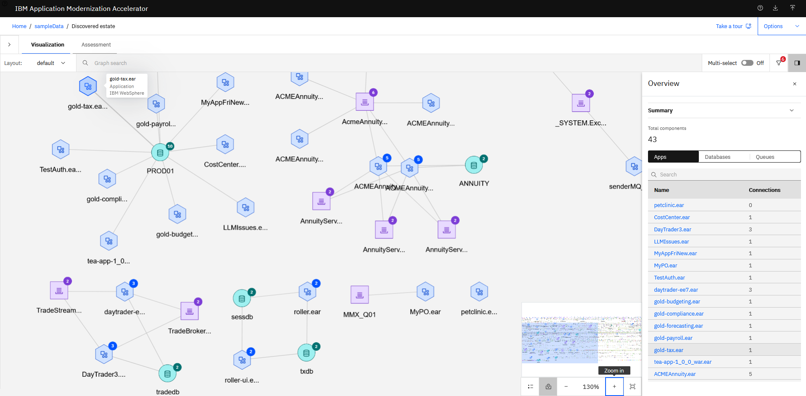</kbd>

Your company wants to move these applications to the modern WebSphere Liberty server on a container-based cloud. However, you are not sure how much effort the migration process might take.

You decide to use the IBM Application Modernization Accelerator to do a quick evaluation of these applications without their source code to identify a good candidate application to move to Liberty and container-based cloud.

After determining a candidate application for modernization to WebSphere Liberty, you use the migration plan to feed it into IBM Bob to let IBM Bob perform the required code changes. Some of them will be based on recipes, others will be done in an agentic way. Finally, you will deploy and run the application on WebSphere Liberty on your local developer machine to validate the solution.

## 2. Objective

The objectives of this lab are to:

- Learn how to use the Application Modernization Accelerator to evaluate the effort involved to modernize to Liberty and container-based clouds and identify good application candidates for modernization.

- Learn how to use the IBM Premium Package for Java Modernization to perform the required code changes.

## 3. Prerequisites

The following prerequisites must be completed prior to beginning this lab:

- Familiarity with basic Linux commands

- Have internet access

- Have a lab environment ready

- Have an IBM Bob account with entitlement to the IBM Bob Premium Package for Java Modernization

## 4. About the lab environment

The lab is written for a lab environment hosted by IBM and the software is already installed.

As IBMer, you can request the related TechZone environment here:

- Collection: https://techzone.ibm.com/collection/liberty-getting-started-labs-demos/journey-modernization-tools
- Environment: **Application Modernization VM - for Liberty, AMA v5, IBM Bob**.

    (Please be aware that there is also an environment for AMA v4)

The following software has been installed:
- Java 17 or beyond 
- Maven
- Git
- The Application Modernization Accelerator
- IBM Bob with the following extensions:
    - The Liberty Tools

## 5. Explore Application Modernization Accelerator
In this section, you will get a brief overview how to explore the main capabilities of Application Modernization Accelerator using the sample data that is shipped with the product. You can find more details on the appendix.

### 5.1 Start AMA

Application Modernization Accelerator(AMA) is already installed and typically running. 

Let's check if AMA is already started. This can be validated by reviewing if the related podman containers are started. 

1. Open a terminal by clicking on Activities and selecting terminal.

    <kbd>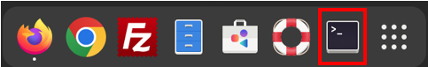</kbd>

    The terminal window opens.  

    <kbd>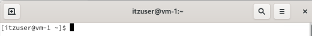</kbd>

    HINT: By default, the terminal window has a dark background.

2. Access the AMA launch script to verify if AMA is started or not

        cd ~/usr/IBM/application-modernization-accelerator-local-*
        ./launch.sh

        
    Check the status if AMA is started. 
    If AMA **is available** (see screenshot below), enter **q** to quit the menu and keep AMA running. 

    <kbd>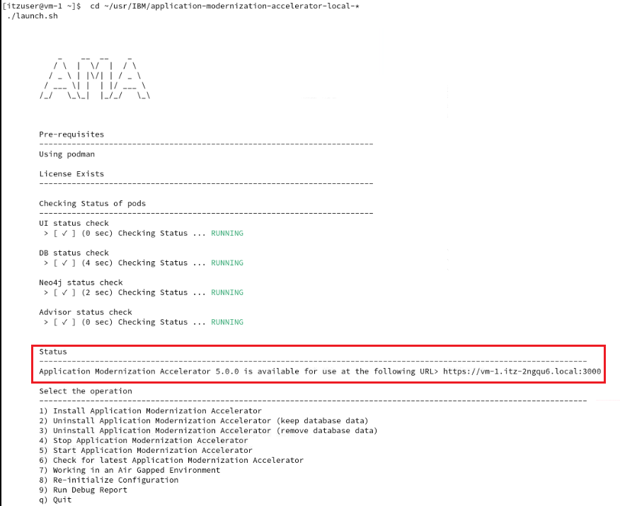</kbd>

    If AMA is available, enter **q** to quit the script.

    If AMA is **not running** (see screenshot below), enter **5** to start AMA. 
    <kbd></kbd>
        
    Wait until AMA has started and the URL is displayed
    <kbd></kbd>

3. Create a demo workspace with sample data via the following command:

        curl -k -X 'POST' \
        'https://localhost:2220/lands_advisor/advisor/v2/collectionArchives/uploadSampleData' \
          -H 'accept: */*' \
          -H 'locale: en' \
          -H 'workspaceName: Sample_Data' \
          -d ''

    A workspace is a designated area that will house the migration recommendations provided by AMA for existing applications and/or environments. 

### 5.2 Access the AMA User Interface

This section will give a brief overview how to use the AMA User interface. You can find more details in the appendix.

1. Access the AMA UI and create a workspace with sample applications.
    1. Open a browser window by clicking on **Activities** and then select the **Firefox** browser icon.

        <kbd></kbd>

    2. Access the AMA User Interface via the URL https://localhost:3000

        If you get a warning, that there is a potential security risk, click on **Advanced** and then **Accept the Risk and Continue**. 

        <kbd>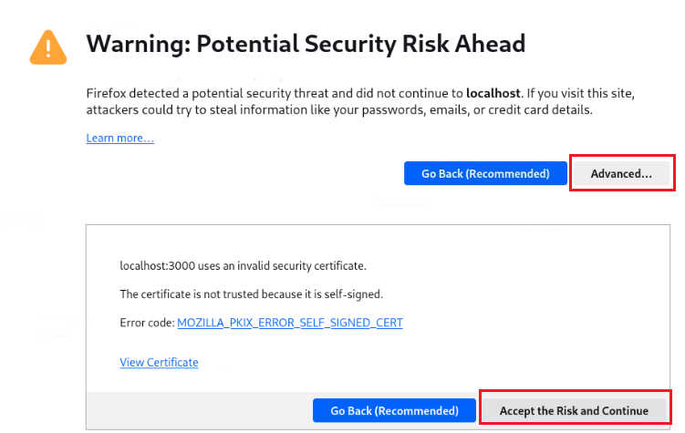</kbd>
    
        Finally, you should see the Application Modernization Overview Screen.

        <kbd>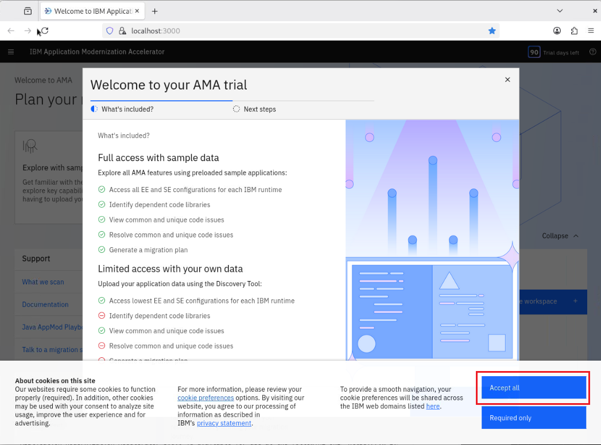</kbd>
    
        Click the button to **Accept all** to accept all cookies.
        An introduction wizard is displayed.

        <kbd>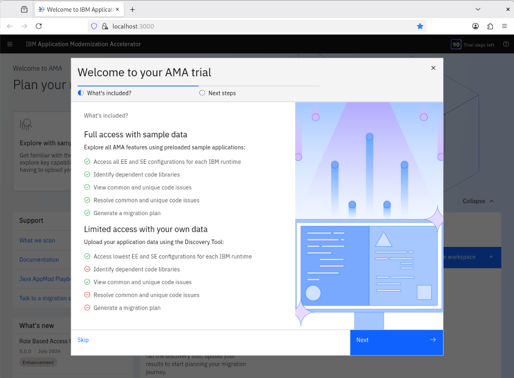</kbd>
    
        Click through the wizard and finally close it.
        Your screen should now look like this:

        <kbd>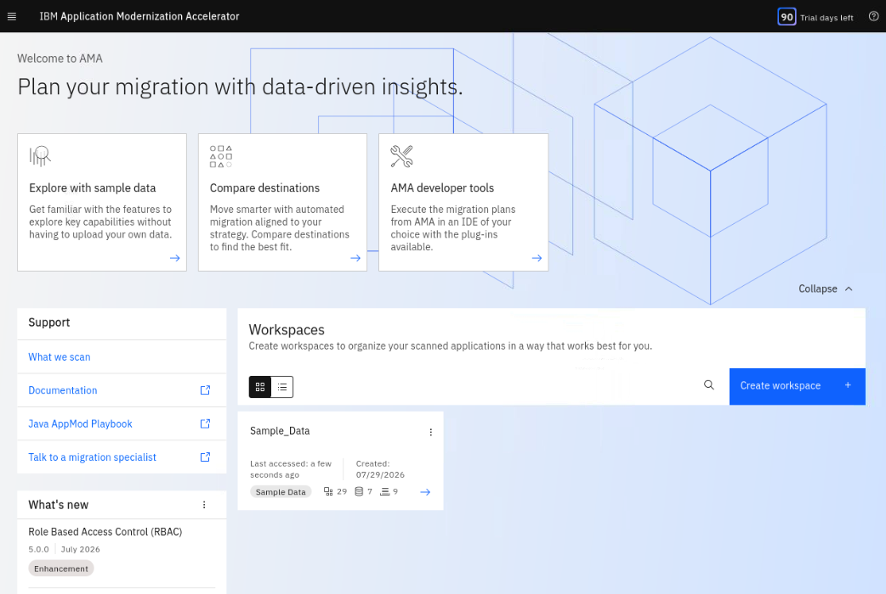</kbd>
    
        A workspace named **Sample_Data** is available and contains 29 sample applications, 7 databases and 9 queues.
    
2. Explore the workspace with the sample applications

    1. Click on the workspace to open it.

    2. AMA supports three destinations, **Liberty**, **MoRE** (Modernized Runtime Extension for Java) and **WebSphere Application Server** (Traditional)
    
        Select **Liberty** as destination and click on **Confirm**.
    
        <kbd>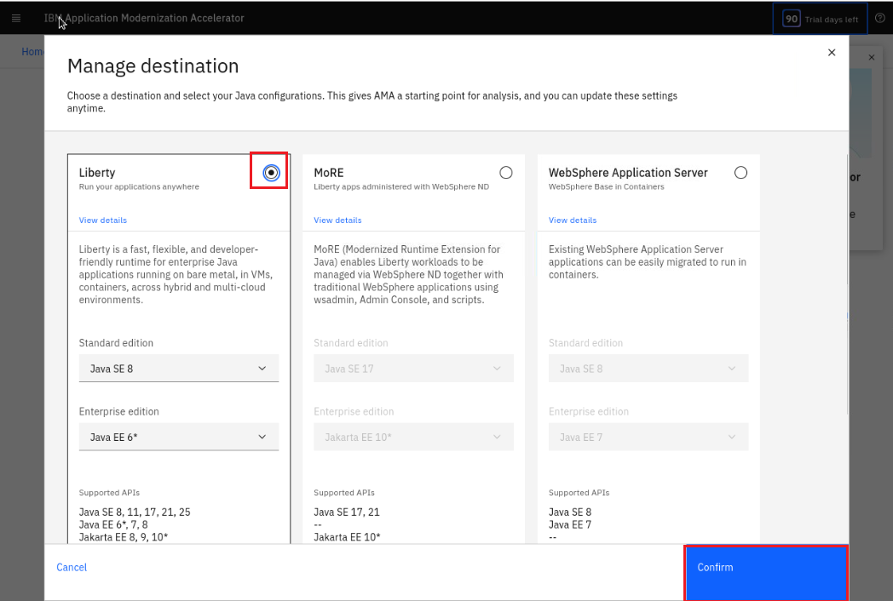</kbd>
    

    3. The **Visualization** panel shows all applications and how they relate to each other regarding common databases or queues.

        As this is an AMA trial version, a pop-up will be shown in the upper right. Close the pop-up.

        <kbd>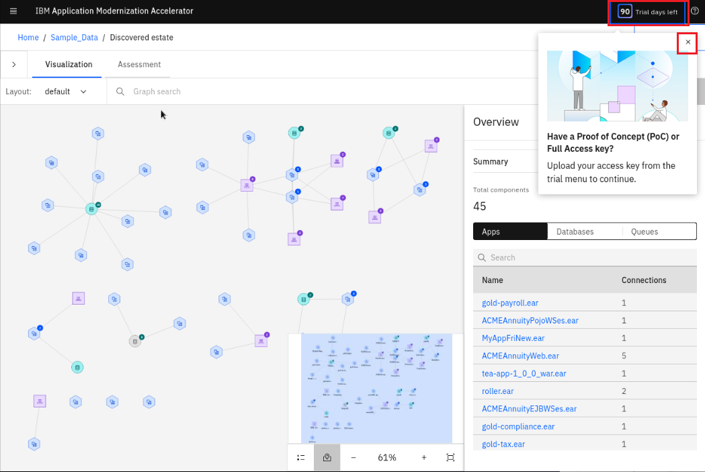</kbd>

        Now zoom in to see the application names.

        <kbd>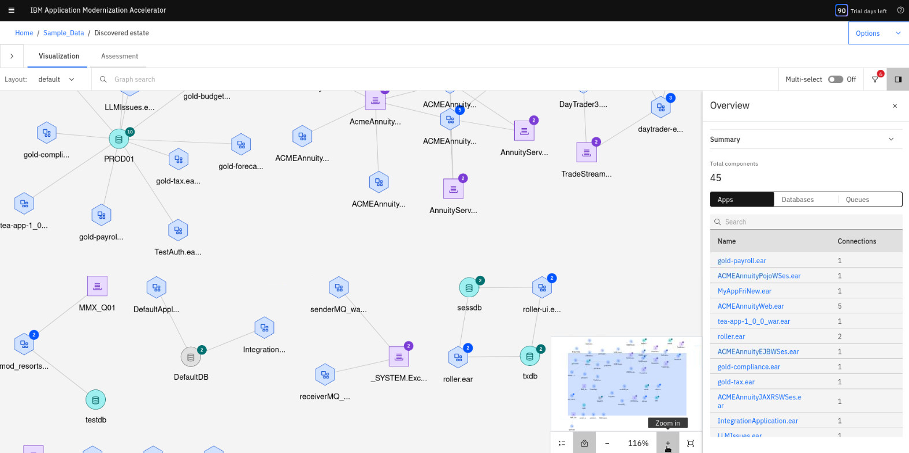</kbd>
        
        You can filter by library to see only specific applications and dependencies. (For example, filter for Spring libraries.)

        <kbd>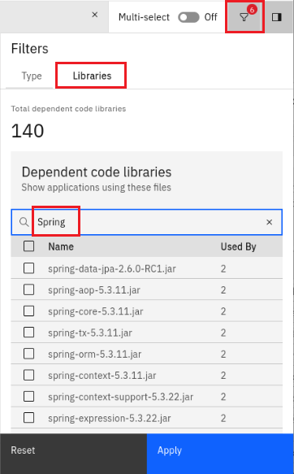</kbd>
    
        As you can see in the screenshot above, the visualization provides insight which applications share the same database or queue which helps to shape your migration strategy.

    4. Switch to the **Assessment** tab 

        <kbd>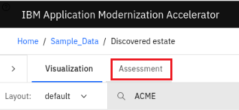</kbd>
    
        The assessment tab provides insight into the different applications.
        <kbd>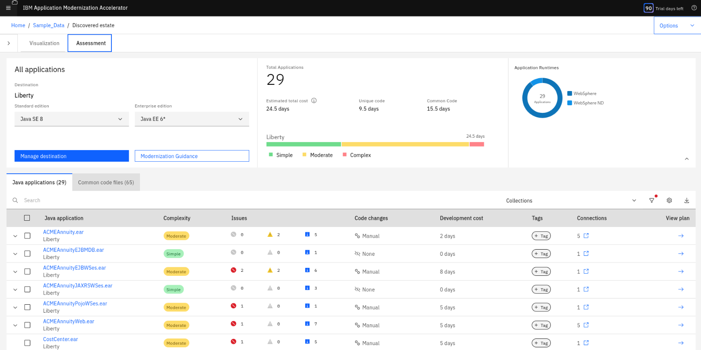</kbd>
    
    5. Take a look at the upper part

        <kbd>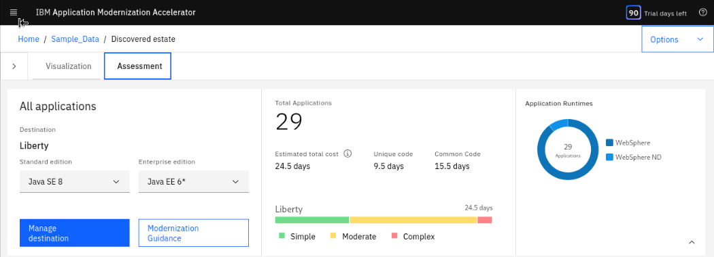</kbd>

        - Under **Applications**, you can change the destination including the Java SE and Java EE level.
        - Under **Total Applications**, you can see the effort for the chosen target. AMA also analyzes all the application code and common code that is shared across applications and provides an estimated total cost for migrating the apps and common code in the workspace. 
        
        Total cost is the number of days of development cost to migrate that code to run on the selected migration target. In this example, WebSphere Liberty is the selected migration target.

    6. Change the Java SE Level and the Java EE level to find out how the overall effort changes. As you can see the estimated efforts change.

        <kbd>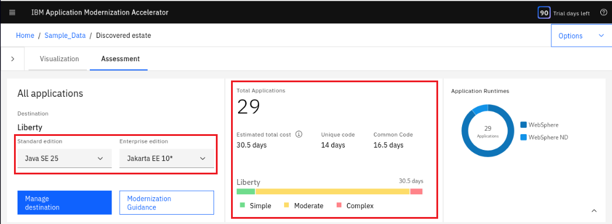</kbd>

        Finally, change the Java SE and Java EE level back to the minimum to see the efforts for the quickest path of modernization. (You must change the Java EE level back to a lower level before you can change the Java Level back to 8. This is due to the fact that Jakarta EE 10 is not supported with Java 8.)

    7. Take a look further down at the application list.

        <kbd>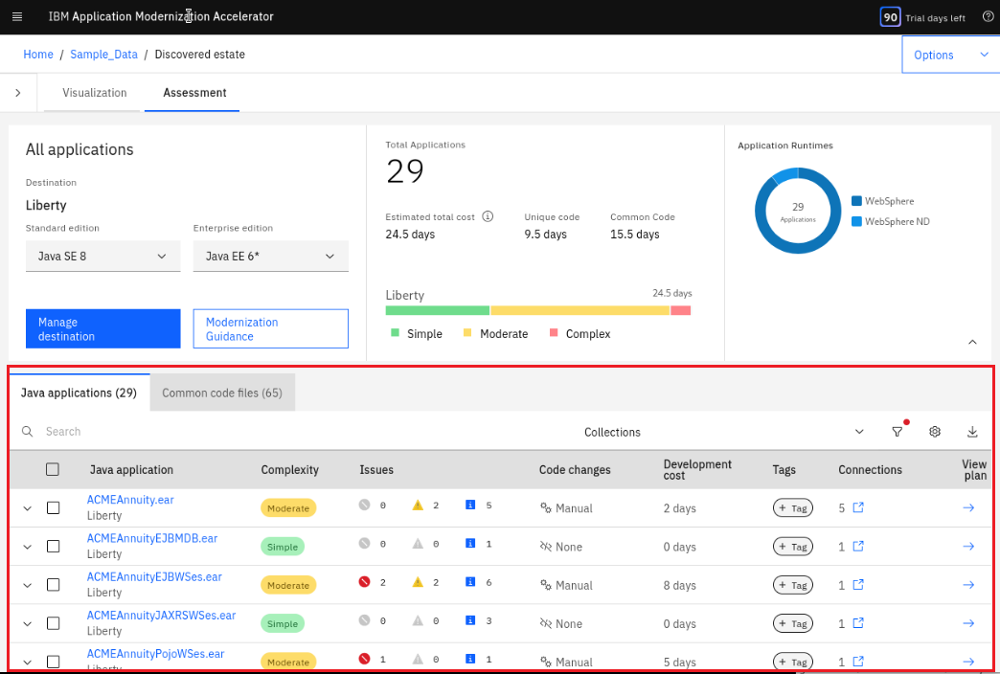</kbd>
    
        The “All Java applications” page also shows the application summary analysis results for all the apps from the AppSrv01 profile for each of the selected migration targets.

        For each app / migration target combination, you can see these results:

        - Java application
        - Collection / Profile name
        - Complexity
        - Issues
        - Required code changes
        - Application cost (in days)
        - Migration plan

    You will look into this further in the next section.   

### 5.3 Explore the AMA APIs
Application Modernization Accelerator (AMA) also provides Swagger interfaces to access some of the data via APIs. 
You already used one of it when you created a demo workspace with sample data.
If you are interested into details about the APIs, take a look at the appendix.

## 6. Build and analyze the modresorts application.

### 6.1 Verify the installed software 

1. Open a terminal by clicking on Activities and selecting terminal.

    <kbd></kbd>

    The terminal window opens.

    <kbd></kbd>

2. Check the Maven version via the following command:

        mvn -version

    <kbd>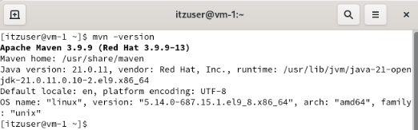</kbd>
    
    The version might be slightly different, but must be higher than 3.8.5

3. Check the Git version via the following command:

        git -v

    <kbd>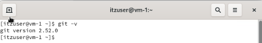</kbd>

    The version might be slightly different.

### 6.2 Create the required working directories

1. Create the Student directories and some sub-directories used in the lab with commands:

       mkdir ~/Student
       mkdir ~/Student/assets
       mkdir ~/Student/backup

### 6.3 Build and deploy the WebSphere applications

The objective of this section is to assess the simple-pharmacy application that has been deployed to a traditional WAS 9 instance.

#### 6.3.1 Build the WAS application

1. Clone the repository to get access to the application binaries and more.

       rm -rf ~/Student/temprepo/
       git clone https://github.com/LarsBesselmann/LibertyGettingStarted-2026-AMA-Lab ~/Student/temprepo
       mv ~/Student/temprepo/modresorts-project ~/Student
       rm -rf ~/Student/temprepo/

2. Install the required WAS library

        cd ~/Student/modresorts-project/

       mvn install:install-file -Dfile=/home/itzuser/usr/IBM/WebSphere/AppServer/dev/was_public.jar -DpomFile=/home/itzuser/usr/IBM/WebSphere/AppServer/dev/was_public-9.0.0.pom

    Make sure that the build is successful.

    <kbd>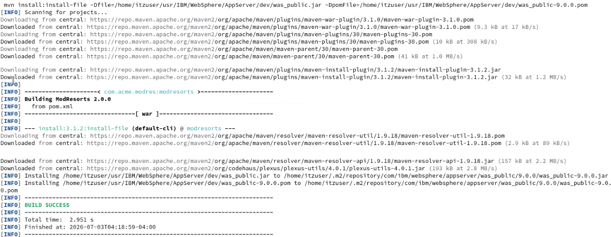</kbd>

3. Build the application
    
       mvn clean package

    <kbd></kbd>

    <kbd></kbd>

4. Copy the generated war file into the assets directory
    
        cp ~/Student/modresorts-project/target/modresorts-2.0.0.war ~/Student/assets/

#### 6.3.2 Deploy the WebSphere application and test it

The application has not been installed to traditional WAS so far. Typically, you would do this now in detail, but this is out of scope here. Please look into the details about the required steps.

Open a terminal window and enter the following commands to install the application:

    ~/usr/IBM/WebSphere/AppServer/profiles/Dmgr01/bin/startManager.sh
    cd ~/Student/modresorts-project/tWAS-Scripts
    ~/usr/IBM/WebSphere/AppServer/profiles/Dmgr01/bin/wsadmin.sh -f ./modresorts_install.py
    ~/usr/IBM/WebSphere/AppServer/profiles/Dmgr01/bin/wsadmin.sh -f ./setURLProvider.py
    ~/usr/IBM/WebSphere/AppServer/profiles/Dmgr01/bin/stopManager.sh

### 6.4 Create an AMA data collection for the WAS applications

You will now switch back to the AMA User Interface and create a new workspace called **Evaluation**. Then you will download the AMA Discovery Tool to scan the existing WebSphere landscape.

To evaluate on-premises Java applications, you need to run the AMA Discovery Tool against the Application server environment. It will extract application information from the environment. The utility can be downloaded from the AMA.

1. Create in AMA a new workspace and download the AMA Discovery Tool.
    1. Switch back to the browser and open the existing AMA window.
    Then click on **Home**
        
        <kbd>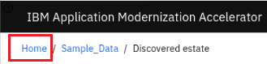</kbd>

        (If you closed the browser window, open a new browser window and enter the URL https://localhost:3000)

    2. You should now be back on the AMA Overview page:

        <kbd></kbd>
    

    3. Click on the button **Create workspace** and enter **Evaluation**, do NOT select **include sample data**, then click on **Create**.

        <kbd></kbd>
    
    4. An empty workspace will be created, and you will be asked if you want to upload an existing data collection or if you want to use the Discovery Tool.
        <kbd>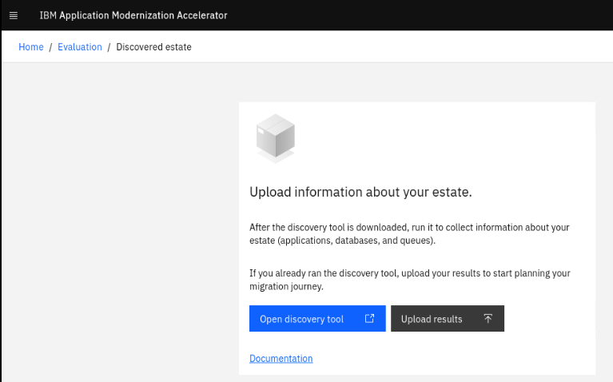</kbd>
    
    5. Click on **Open discovery tool**.
        <kbd>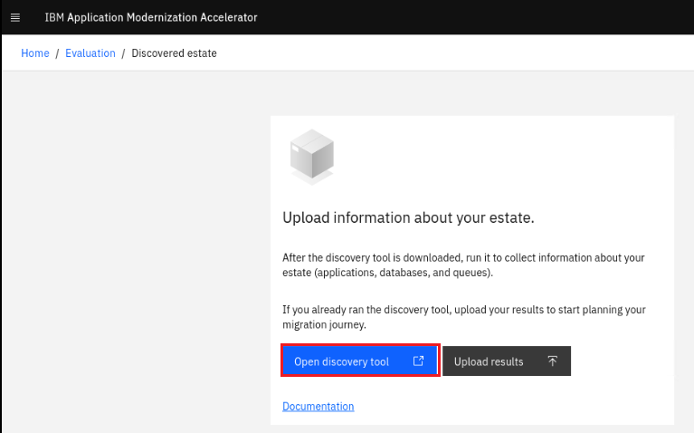</kbd>
    The Discovery Tool panel opens and provides the option to download the tool; in addition, it provides information how to use the tool. 
    6. Click on **Download discovery tool**.
    <kbd></kbd>

        The discovery tool package will be generated and prepared for download.
        Once done, you will likely get a warning, that there is a potential security risk, click on **Advanced** and then **Accept the Risk and Continue**. 

        <kbd>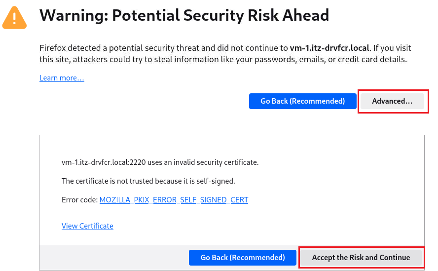</kbd>

    
        The AMA Discovery Tool package will be generated and downloaded.
        <kbd></kbd>
    
        It will include next to the scanner also the information to upload the data collection once created.

    7. Click the back button to return to the Discovery Tool page.

        <kbd>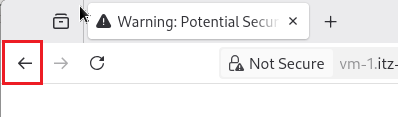</kbd>
    
    
2. Use the AMA Discovery Tool to analyze the installed WebSphere Applications.

    Run the AMA Discovery Tool against your WebSphere environment. After downloading the zipped Data Collector utility, it needs to be unpacked and run against a WebSphere Application server (WAS) to collect all the data of deployed applications and their configuration from the WAS server.

    1. Go back to the Terminal window and navigate the /home/itzuser/Downloads directory and view its contents with commands:

            cd /home/itzuser/Downloads/
            ls -l | grep Discovery

        <kbd>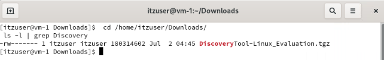</kbd>
            
        You can see the downloaded Discovery Tool file named “DiscoveryTool-Linux_Evaluation.tgz”

    2. Extract the data collector utility to the Student directory using the following command:

            tar xvfz DiscoveryTool-Linux_Evaluation.tgz -C ~/Student

        The Discovery Tool will be extracted to ~/Student/ama-discovery-5.0.0 directory.

        Note: At this point, the data collector is ready to execute against a WebSphere environment.

    3. Return to the AMA UI in the Web browser to view the section on “Run the Tool”, which shows the command to run on the WebSphere environment.

        a. From the Discovery Tool page, scroll down to the “Run Tool” section.

        <kbd></kbd>
        
        The Discovery tool command that would be executed is based on the domain and analysis type selections you make in this section.

        b. Select the domain.

        Open the twisty to see the different domain options:

        <kbd></kbd>
        
        Change the domain and you can see that the command will change.
        Finally, switch back to the **IBM WebSphere** Domain. 

        c. Select the Analysis type
        
        Open the twisty to see the different analysis types:

        <kbd>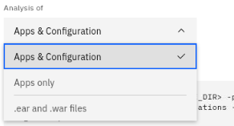</kbd>
        
        Change the analysis type and you can see that the command will change. Finally, switch back to the **Apps & Configuration** analysis. 
        Selecting **Apps & Configuration** ensures that the application data and server configuration data is collected.
 
        The server configuration data is extremely helpful in Transformation Advisor to generate deployment artifacts in the migration bundle, which we will explore later in the lab.
 
        d. Review the final command.
        To analyze the application and configuration for WebSphere will be done using a command as shown in the screenshot
        <kbd>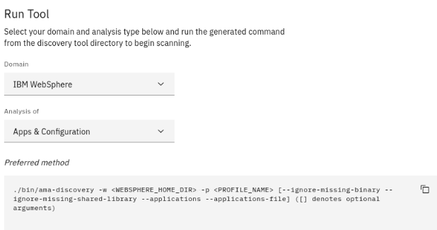</kbd>
    

6.  Execute the AMA Discovery Tool.

    1. Go back to the Terminal window and navigate the directory where the AMA Discovery Tool was extracted, then list the content:

            cd ~/Student/ama-discovery-*
            ls -l

        <kbd>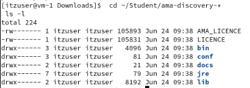</kbd>

    2.  Execute the following command to start the AMA Discovery Tool:

            ./bin/ama-discovery -w ~/usr/IBM/WebSphere/AppServer

        <kbd></kbd>

        The license agreement will be displayed, and you will be asked to accept it. 
        
        <kbd>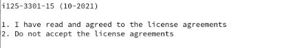</kbd>
        

        Type **1** to accept the license agreement and press **Enter**.

    3. Wait until the analysis has completed. As you can see, 4 applications have been analyzed, and the resulting data collection has been automatically uploaded. 

        <kbd></kbd>
    
        The collection is also available as zip file in the directory where the discovery tool was called. It is named like the WAS profile.

            ls -l

        <kbd>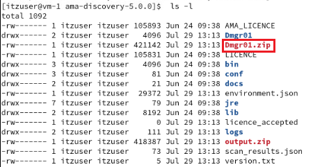</kbd>

        Comments: 
        - In the lab, the process only takes a couple of seconds. In a real scenario, the process typically takes some time to complete, depending on how many applications are deployed on the WebSphere Application server and the complexity of the applications. As this process consumes some CPU and memory, it is not recommended to run the discovery tool in production.
        - You might have recognized that the WebSphere applications were discovered even though the WebSphere instances were stopped. This is due to the fact that the discovery tool looks into the WebSphere files instead of connecting to a running instance.
        - In the lab environment, the discovery tool can connect to the AMA instance via port 2220. Therefore, the collected data has been automatically uploaded. If this is not the case, you must copy over the data collection zip to another system and manually upload the data to AMA from that system before you can view the results. 
        - You can also specify in the ama-discovery command not to upload the data collection automatically. 

    4. Return to the AMA UI in the Web browser and you can see that the data collection has been uploaded. 
    
        <kbd>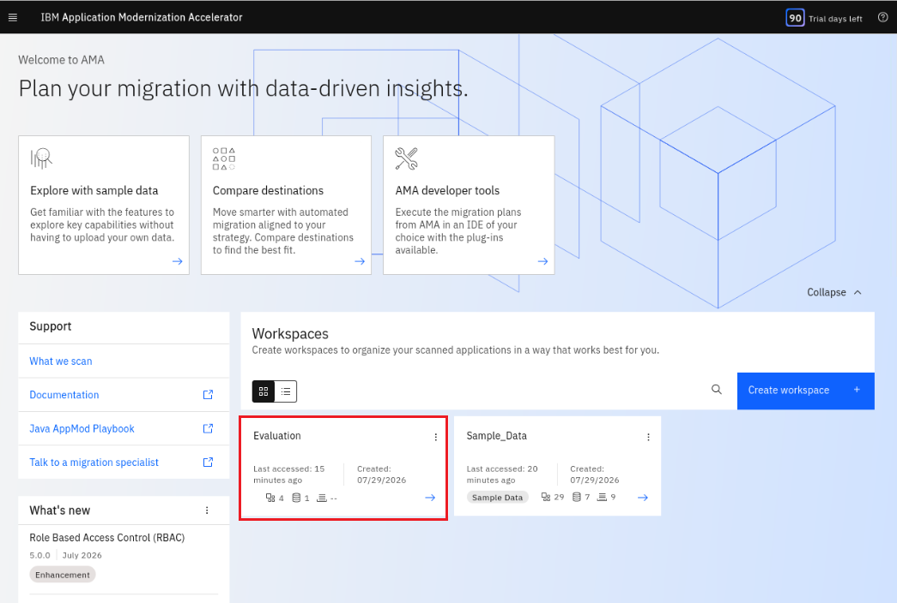</kbd>

    5. Click on the **Evaluation** workspace to open it.  
    You will be asked to specify the modernization destination. Select **Liberty** as destination and click on **Confirm**.
    
        <kbd></kbd>

        The Evaluation workspace will open in the Visualization View. 
    
        <kbd>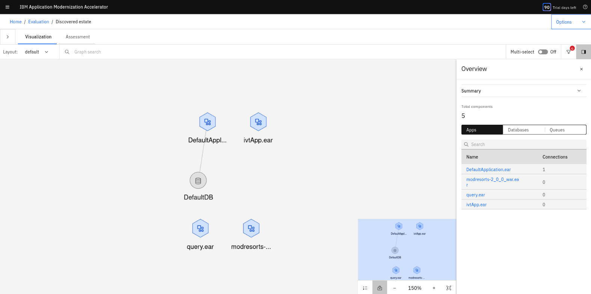</kbd>

        You can see the 4 applications that have been discovered.

    
    **IMPORTANT!**
    
    As backup for this lab, we have placed the data collection archive (zip file) at: ~/Student/modresorts-project/ama/Dmgr01.zip. 
    ___

### 6.5 Assess the applications using AMA

In this section of the lab, you will explore assessment details for the **modresorts** application. 

#### 6.5.1 Assess the applications using the AMA Trial

1. In the AMA Visualization View, you can see that the modresorts application has no connections to a database or queue.
 
    <kbd>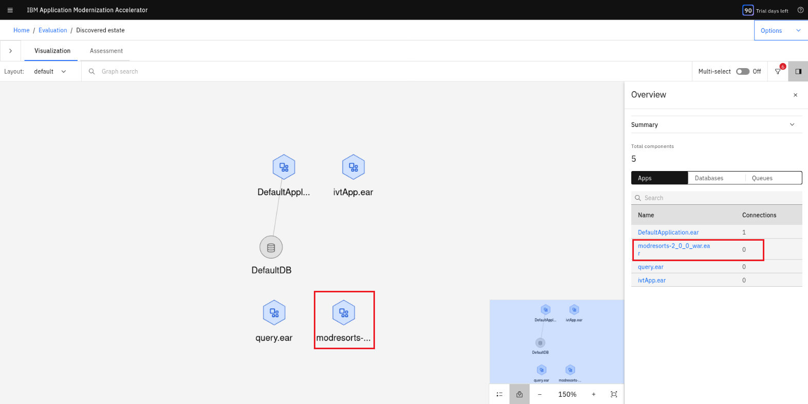</kbd>

2. Switch to the Assessment View.

    <kbd>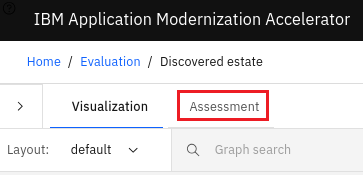</kbd>

    You can see the assessment details for the 4 applications and the efforts to modernize them to Liberty.
    <kbd>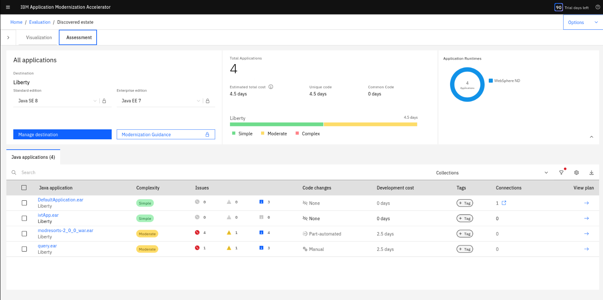</kbd>

3. In the environment, the trial version of AMA is used. Therefore, the assessment of the applications for higher Java SE level or Java EE level is only supported for sample data workspaces but not in this workspace. You would need a different access key to unlock the option. This will be done later.

    <kbd>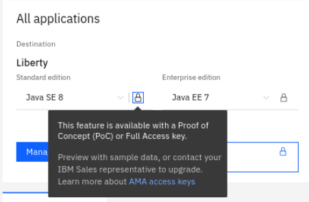</kbd>

4. You will now assess the modresorts application.

    1. Enter as filter the text *modr** to see only the modresorts application. 

        <kbd>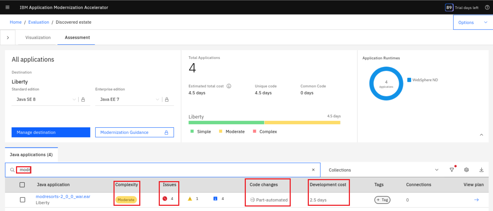</kbd>

        The application modresorts has been assessed
        - of complexity **Moderate**, which means that code changes might be required
        - **5 severe issues** have been identified with need to be fixed
        - some of the required code changes can be done automated via recipes
        - the estimated development effort is 2.5 days
    
    2. Click on the application to get more details
        
        <kbd>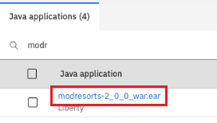</kbd>

    
    3. Scroll down to the section **`Complexity Score`** and expand the list of issues. 

        <kbd>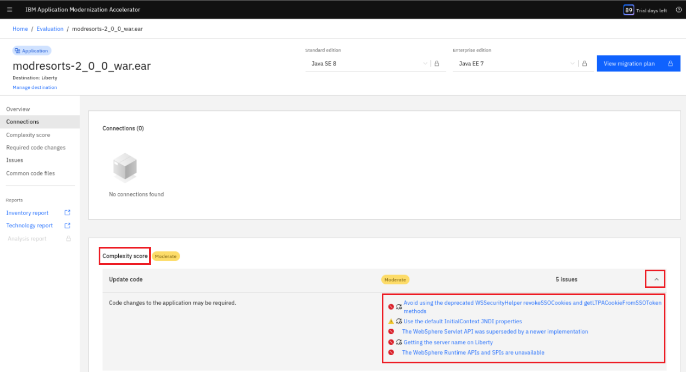</kbd>

        Here, you get insights into the related issues that may require code changes or configuration changes. 

        *In this example, there is 5 issues of which 3 have an automated fix:*

        - **Avoid using the deprecated WSSecurityHelper revokeSSOCookies and getLTPACookieFromSSOToken methods**
        - **Use the default InitialContext JNDI properties**
        - **The WebSphere Servlet API was superseded by a newer implementation**
        - **Getting the server name on Liberty**
        - **The WebSphere Runtime APIs and SPIs are unavailable**

        There are also 4 **informational issue** which are well known and documented how to resolve by the migration tools.

        <kbd>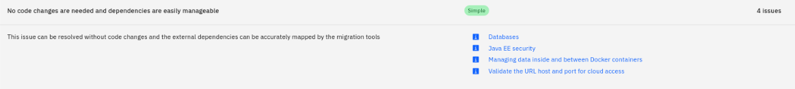</kbd>

    4. Scroll down to the section **Issues**. 

        As you can see, there are no issues in common code.

        <kbd>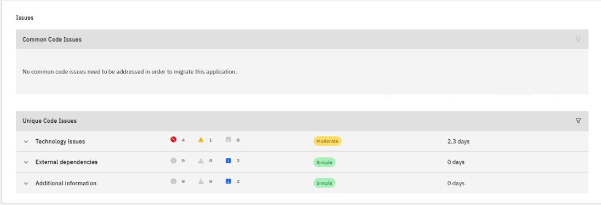</kbd>

        Under **Unique Code Issues**, expand the list of **Technology issues**.

        <kbd>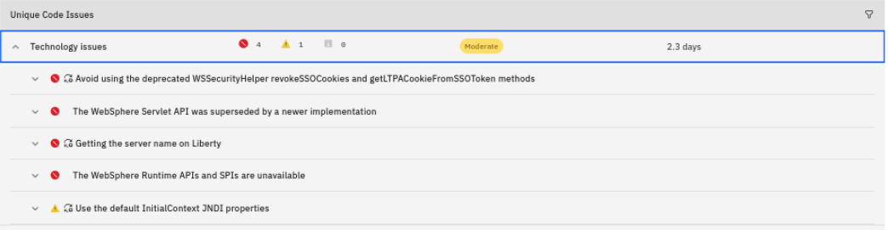</kbd>

        Expand any of the 5 issues and you can get more details about the issue, recommended changes and which code is impacted. But this capability is not available with a trial access key.

        <kbd>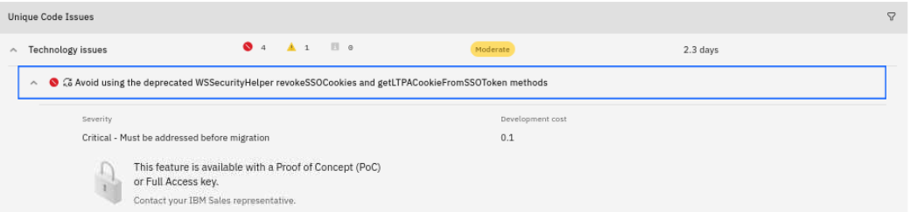</kbd>
        You will come back to this section later when the PoC access key has been applied.

    5. In addition to the information in the view, AMA also provides different kinds of reports:

        <kbd>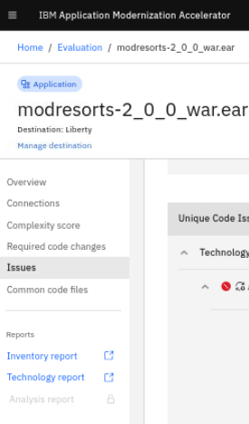</kbd>

        - The **Inventory Report** helps you examine what is in your application, including the number of modules and the technologies in those modules. It also gives you a view of all the utility JAR files in the application that tend to accumulate over time. Potential deployment problems and performance considerations are also covered.
       
        - The **Technology Report** identifies the editions of WebSphere Application Server that are best suited to run the application. The report provides a list of Java EE programming models that are used by the application and indicates which platforms will support the application.

        - The **Analysis Report** does a deep dive on the preferred migration target to help you understand any migration issues, like deprecated or removed APIs, Java SE version differences, and Java EE behavioural differences. Note that Application Modernization Accelerator uses a rule system based on commonly occurring events that are seen in real applications to enhance the base reports and provide practical guidance. As a result, some items may show a different severity level in Application Modernization Accelerator than they do in the detailed binary scanner reports. 

        The **Analysis Report** is greyed out and not available with an AMA trial access key.
        Feel free to look at the other two reports.

    
    Scroll to the top and you can see that the migration plan is locked.

    <kbd>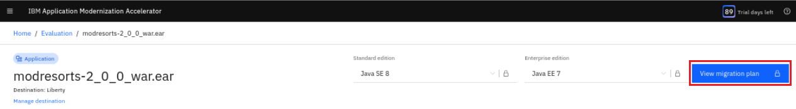</kbd>

#### 6.5.2 Assess the applications using the AMA PoC key
Now lets apply an AMA Access Key so that you get access to the analysis detals and the migration plan. You can find details how to apply the PoC Access key via User Interface in the appendix.

1. Switch to a terminal window and run the following command the apply the access key. 

        sh ~/software/AMA/AMA_apply_PoC_Key.sh 

2. Switch back to the AMA User Interface

3. The PoC wizard will be shown. Feel free to walk through the wizard, then close it.

    <kbd>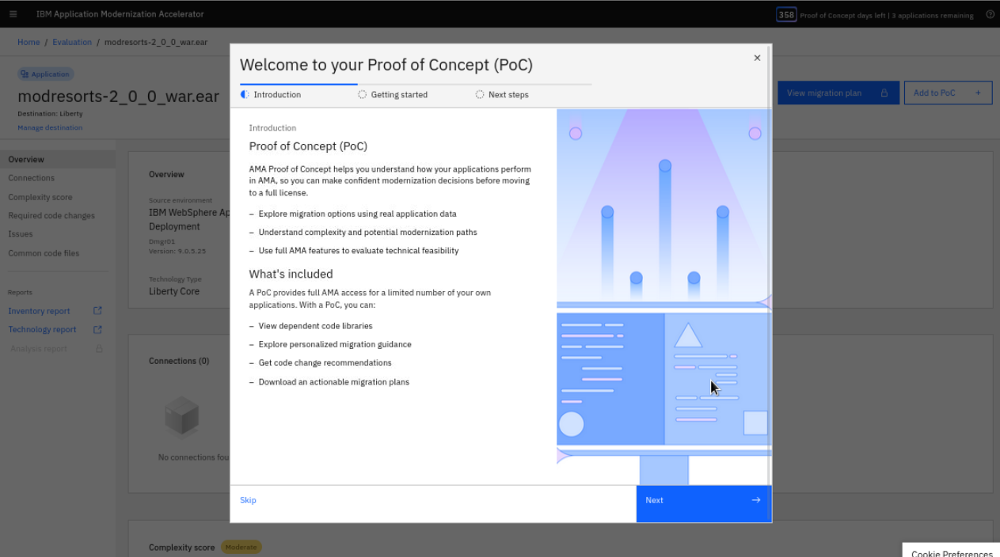</kbd>

    As you can see, the display on the top right now switched to **Proof of Concept** and shows that there are 3 applications remaining. This means that you got access to analyze 3 applications.

    <kbd></kbd>

4. The next step is to add the **modresorts** application to the PoC.   Click on **Add to PoC**

    <kbd>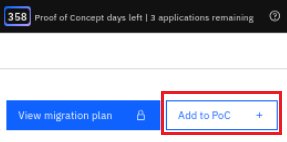</kbd>

5. You will be asked to confirm that you want to **modresorts** application to the PoC. Click on **Confirm**.

    <kbd>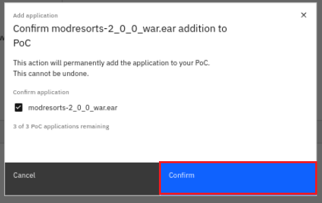</kbd>

6. As you can see, the application has been added to the PoC, and the migration plan has been unlocked.

    <kbd>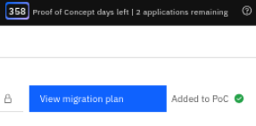</kbd>

    Before you go to the migration plan, you will take a look at some other unlocked capabilities.

7. Take a look at the left and you can see that the **Analysis report** has been unlocked.

    <kbd>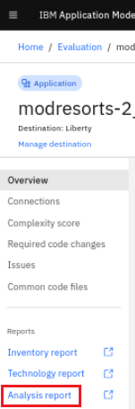</kbd>

    Feel free to look into the report.

8. Scroll down to the section **Issues**. 

    Under **Unique Code Issues**, expand the list of **Technology issues**.

    <kbd></kbd>

    Expand any of the 5 issues and you can get more details about the issue, recommended changes and which code is impacted. 

    <kbd>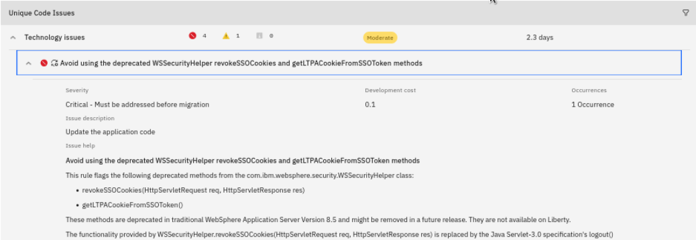</kbd>
    
    **This capability is not available with the trial access key.**

### 6.6  Examine the Liberty modernization assets generated by AMA

AMA not only provides great insights about your applications that you consider modernizing to WebSphere Liberty, but it also generates deployment accelerators for building and deploying the application on Liberty, containers, and Kubernetes based clouds. 

In this section, we take a quick peak at the **Liberty server configuration** `server.xml` that AMA generates, based on the analysis of the WebSphere configuration when the Transformation Advisor data collector was run against the WebSphere server on the VM.  

Simply put, AMA creates the server.xml file that contains the Liberty server configuration required to run the application on Liberty.  

1.	On the modresorts page, click on the button in the upper right called **View migration plan**.

    <kbd>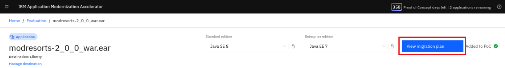</kbd>

 
2.	The **Migration plan** displays a "partial list" of files generated by AMA to assist in the migration of the application.

    - **server.xml:** the configuration for the Liberty server
    - **pom.xml:** Build the application using Maven
    - **Containerfile:** Create the Docker image for the application
    - **application-cr.yaml:** Custom Resource for the application to be deployed to OpenShift via the Open Liberty Operator
    - **secret.yaml:** Configuration file for defining secrets etc. in Kubernetes

    <kbd>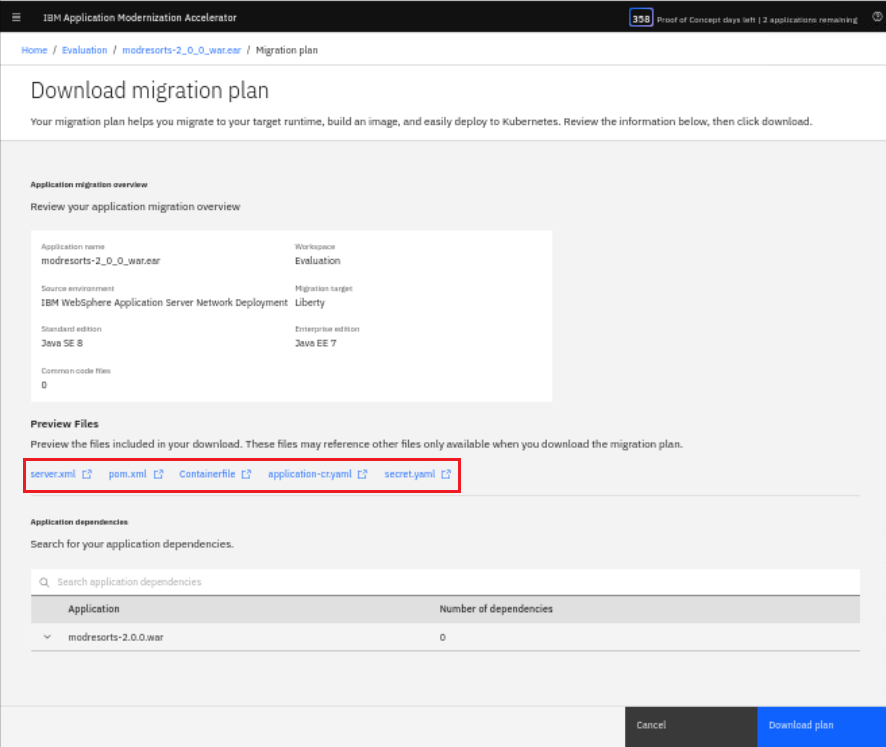</kbd>

3.	Click to view the contents of the **server.xml** file.
	The **server.xml** is displayed in the File preview window, click **`Show more`** to expand it.    
    <kbd></kbd>

4.	Review the contents of the **server.xml** file.

    Notice that AMA generated the **server.xml** file that includes the Liberty server configuration that has been mapped from the original WebSphere traditional application server. 

    When the AMA Discovery Tool was run against the WebSphere Application server, it analyzed the applications and the WebSphere server configuration. The WAS server configuration data was used to generate an appropriate server.xml file to configure the application on Liberty. 

    a.	The **Liberty features** that the application uses are configured. 

    <kbd>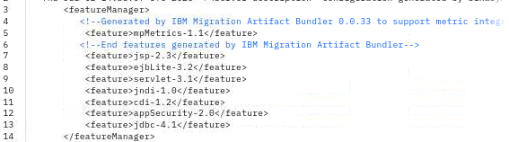</kbd>

    b.	The **application endpoints** and **enterprise application module configuration** including **context root**, **Security roles** used by the application are configured. Notice that **variables ${ }** are used to simplify external configuration overrides and default values. 

    <kbd></kbd>

    c.	**Resource configurations** like URLProviders, JDBC or JMS Provider, etc.

    <kbd></kbd>

    d.	**Variables** with default values, where it makes sense are configured.
    These variables are used to make the configuration portable so that it can be used in different stages.

    <kbd></kbd>

    The variables are easily overridden by environment variables or configMaps and secrets in Kubernetes environments. 

    e. Close the File Preview, then scroll down and open the twisty to see application dependencies. As you can see, the application has no dependencies

    <kbd>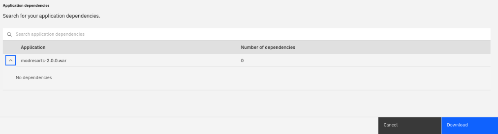</kbd>

5. Click to download the **Migration Plan** generated by AMA.

    <kbd></kbd>

    The migration plan will be downloaded to the Downloads directory.
    <kbd>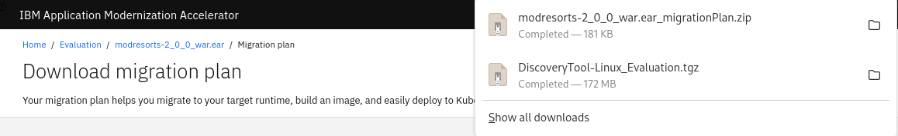</kbd>

    
10.	Switch to the terminal window and execute the following command to see the content of the migration bundle. 

        unzip -t ~/Downloads/modresorts-2_0_0_war.ear_migrationPlan.zip 

    
    <kbd></kbd>

    Next to the files mentioned before, the migration bundle contains several other files for Kubernetes deployment, for kustomization as well as placeholder files for the application and the JDBC drivers.

11. Close the browser window containing the AMA UI.

### 6.8 Recap

Congratulations, you have finished the application assessment part.

**Let’s recap what you did so far.** 

- You installed and tested the modresorts application on a traditional WAS instance
- You explored AMA using some application data 
- You ran the AMA Discovery Tool to assess a WebSphere cell
- You assessed the modresorts application
- You generated a migration plan

### 6.9 Troubleshooting

 Please open if you run into issues 

You will need the migration plan in the next section. 

1. If not already done, create the required working directories

        rm -rf ~/Student
        mkdir ~/Student
        mkdir ~/Student/assets
        mkdir ~/Student/backup

2. Clone the repository to get access to the application binaries and more.

        rm -rf ~/Student/temprepo/
        git clone https://github.com/LarsBesselmann/LibertyGettingStarted-2026-AMA-Bob-Lab ~/Student/temprepo
        mv ~/Student/temprepo/modresorts-project ~/Student
        rm -rf ~/Student/temprepo/

3. Install the required WAS library

        cd ~/Student/modresorts-project/

        mvn install:install-file -Dfile=/home/itzuser/usr/IBM/WebSphere/AppServer/dev/was_public.jar -DpomFile=/home/itzuser/usr/IBM/WebSphere/AppServer/dev/was_public-9.0.0.pom

    Make sure that the build is successful.

    <kbd></kbd>

4. Apply the AMA PoC access key:

        sh ~/software/AMA/AMA_apply_PoC_Key.sh 

      
5. Copy the migration plan to the Downloads directory

        cp ~/software/AMA/modresorts/modresorts-2_0_0_war.ear_migrationPlan.zip ~/Downloads/

 

## 7. Use the IBM Bob Premium Package for Java Modernization

Now you will use AMA Dev Tools to do the required code changes. AMA Dev Tools will help you to apply automated fixes and see the remaining issues in the source code.

### 7.1 Explore the IBM Bob installation and complete setup

1. Initialize git

    Open a terminal window and switch to the project directory, then initialize git.

        cd ~/Student/modresorts-project
        git init
        git config --global user.name "John Doe"
        git config --global user.email john.doe@noreply

        git add .
        git commit -a -m "Initial project"

2. Open IBM Bob

    1. Start the IBM Bob IDE

            bobide . &

        The IBM Bob IDE will be opened.

        If you get a Welcome panel offering to import settings, click on **Skip for now**,

        <kbd>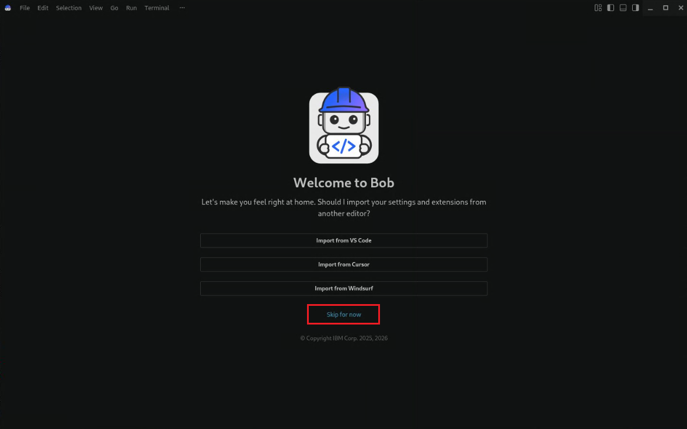</kbd>
        

    2. If you get a pop-up that a Bob update is available, click on settings and select **Keep current version**.

        <kbd>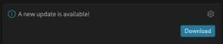</kbd>

        <kbd>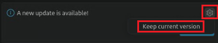</kbd>
       

    3. If you get a **Bob Getting Started** panel, close it:

        <kbd>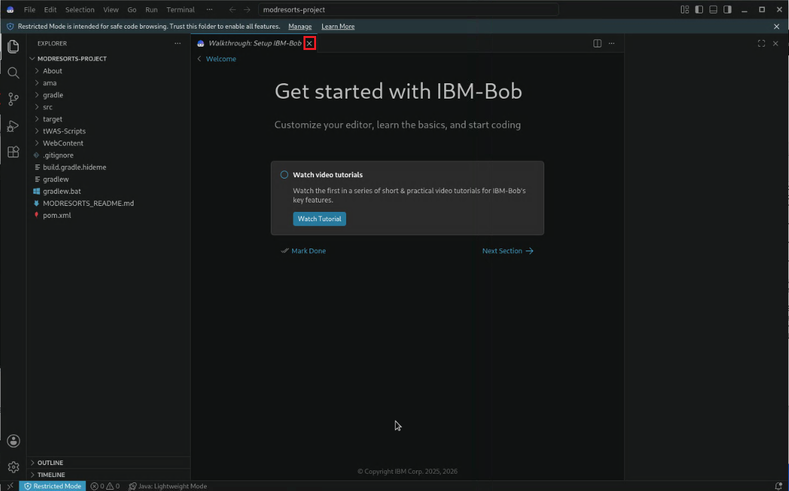</kbd>

    4. If you see during the lab a pop-up like below or any other pop-up asking to install something, close the pop-up without installation by clicking the **X**. 

        <kbd>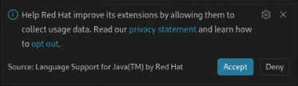</kbd>

    5. Look at the bottom left of your Bobide window to find out if Bobide runs in Restricted Mode.

        <kbd></kbd>

        If so, click on the field **Restricted Mode** to open the panel.

        <kbd></kbd>

        Then click on **Trust** to make this workspace trusted.
        <kbd>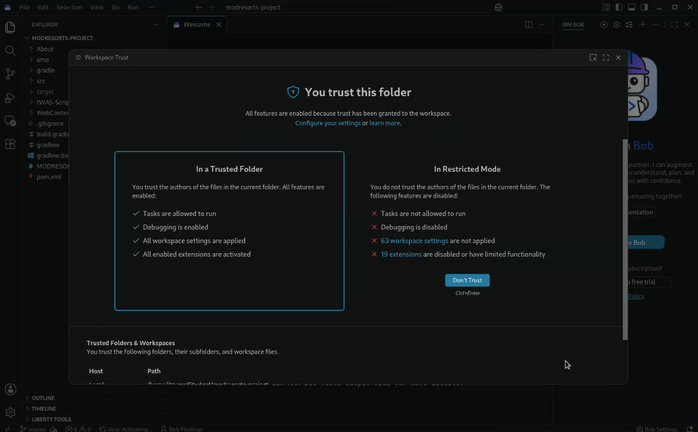</kbd>

        Finally, close the pop-up by clicking on **X**.
        <kbd></kbd>

        If you used Bob before, you might see a **Migration** panel like this:

        <kbd>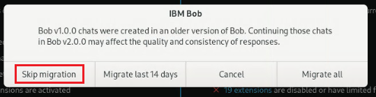</kbd>

        Click on **Skip migration** to continue.

        
    4. The lab document uses the color theme **Bob Theme**. If you want to change your theme, you can do so under settings. 

        <kbd></kbd>

    

3. Take a look at the installed extensions

    1. Open the Extensions panel

        <kbd></kbd>

    2. Click on the extension called **Liberty Tools**. The Liberty tools provide an easy way to develop against Liberty

        <kbd>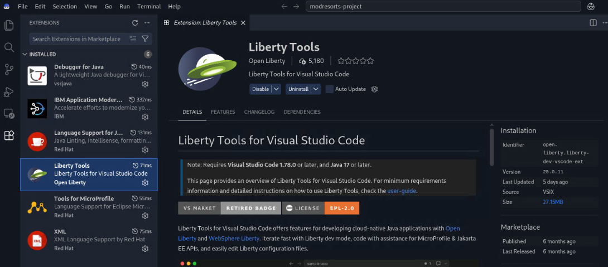</kbd>

        Look at the details, then close the Liberty Tools Extension panel.
        You might have a newer version displayed.
    
        You will use the Liberty Tools Extension during the lab.

4. Log into IBM Bob
    1. On the right side of the IDE, click on the button **Log in to Bob** 

        <kbd>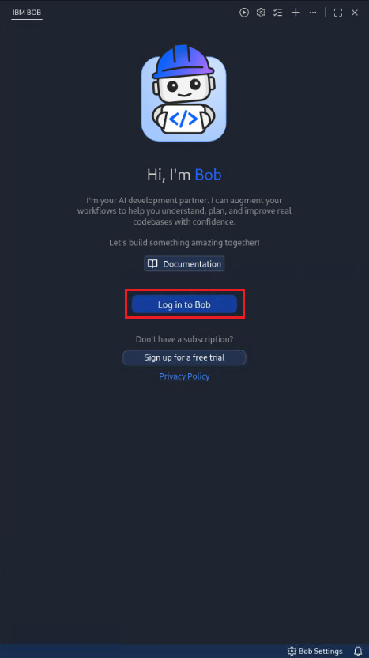</kbd>

    2. On the pop-up, click on **Allow**. 

        <kbd></kbd>

        Click on **Open**

        <kbd>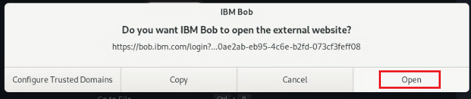</kbd>

        A browser window will open.

        <kbd></kbd>

    3. Choose a way of login and enter your login credentials.

        <kbd>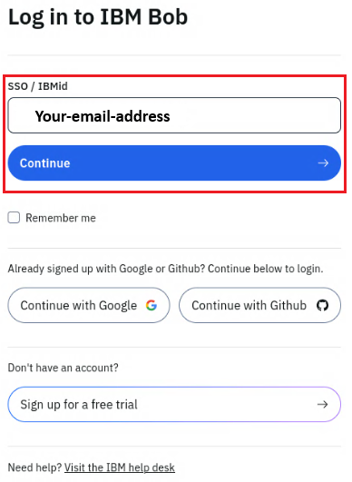</kbd>

        The example uses SSO with the IBMid.

    4. On the new browser page, select **Open Link**

        <kbd>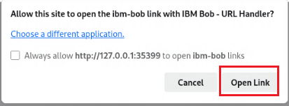</kbd>

        You should see a panel like this:

        <kbd></kbd>

    5. Switch back to the IBM Bob IDE and you should see a pop-up like this:

        <kbd>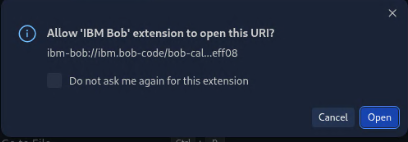</kbd>

        Click on **Open**.

        You should now have access to IBM Bob and the IBM Bob chat window:

        <kbd>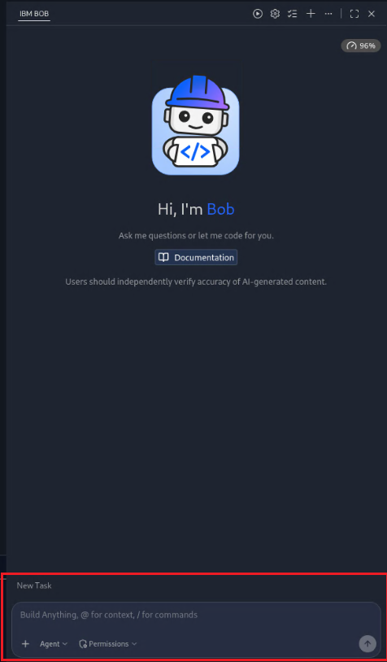</kbd>

5. Verify that you use an account that has access to the IBM Premium Package for Java Modernization

    1. On the upper right part of the Bob IDE, click on the **Settings** icon.    Then take a look at the account:
    
         <kbd>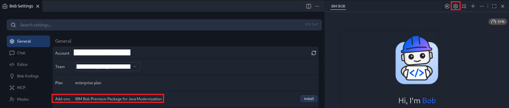</kbd>
      
        If you have a user with access to the premium package, it is listed under add-ons (see above). 
        
    2. Perform these steps if the premium package is not listed.

        <kbd>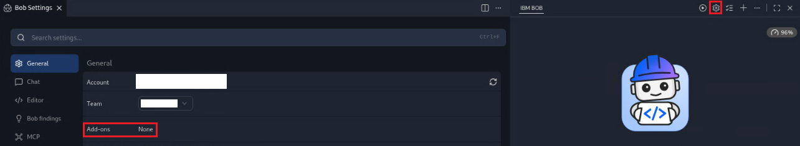</kbd>
  
        If you don't see the premium package, your account might be mapped to multiple teams. 
        
        Try to switch the setting for **Team** to find the appropriate team.

        <kbd>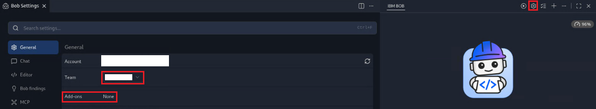</kbd>
  
        If you have multiple accounts, switch the account by log out of IBM Bob and then login again. 

        <kbd>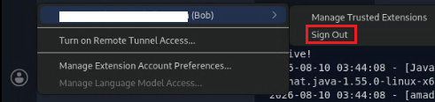</kbd>
  
    3. Finally, you should have an account that has access to the premium package.

        <kbd></kbd>
    
6. Install the premium package extension:
    
    1. In the list of **Add-ons**, click on the **Install** button next to **IBM Premium Package for Java Modernization**.
    
        <kbd>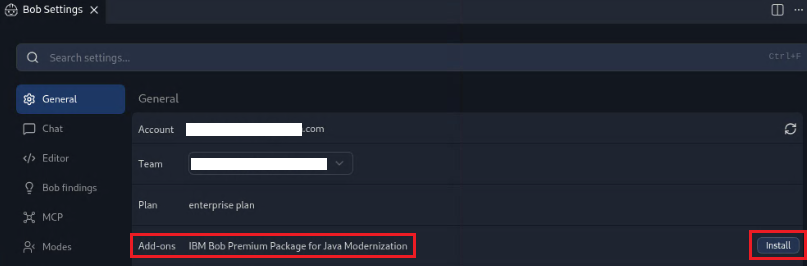</kbd>
    
    2. In the pop-up, click on **Trust Publisher & Install**.
    
        <kbd></kbd>

    3. Finally, you should see something like this:

        <kbd>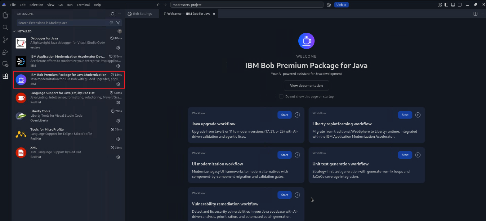</kbd>

        As you can see, you could start the modernization workflow from here.

    4. If the **IBM Bob** Panel on the right is not open, click on the **Bob** icon to open it.

        <kbd>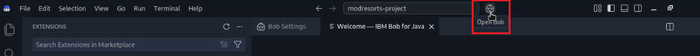</kbd>

    
    5. In the **IBM Bob** panel, click on the workflow icon and take a look at the Bob workflows that are offered. 
    
        You should see different workflows including the ones for Java Modernization (which are expanded in the screenshot below):

        <kbd>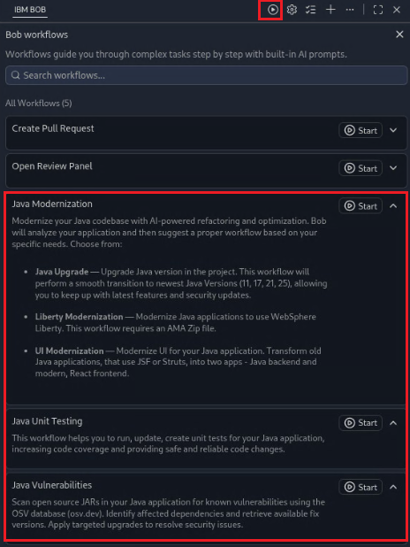</kbd>

### 7.2 Modernize modresorts to WebSphere Liberty using IBM Bob
In the section you will use the **Liberty Modernization Workflow** to modernize the application to Liberty.

1. Start the Java Modernization workflow

    1. In the **Bob** panel, click on **Permissions** to see which activities IBM Bob is allowed to do without approval. Set the settings to **Read**.
    This will allow you to better understand the workflow and decisions.

        <kbd>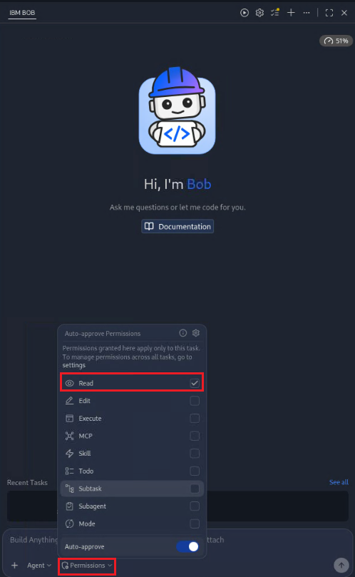</kbd>

    2. In the **Bob** panel, expand the Java Modernization workflow and click on **Start**.

        <kbd>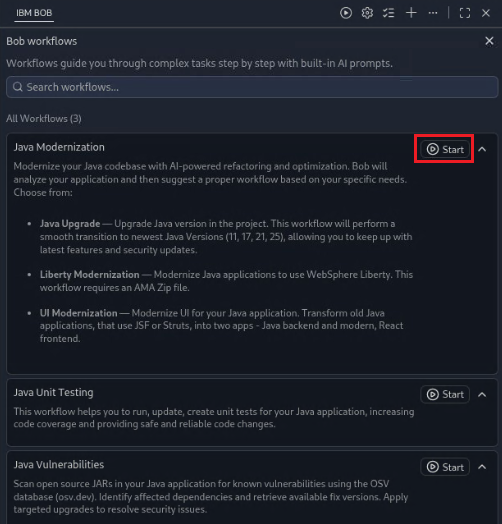</kbd>

    3. Open the twisties in the **Getting Started** section to get some background.
    
        <kbd></kbd>

        Finally, click on **Continue**.

2. Bob prepares the modernization

    1. Bob has detected that the application uses Spring and offers to analyze the application for vulnerabilities. 
    
        <kbd></kbd>

        Click on **Approve once**.

    2. Review the vulnerability results by expanding the twisties.
    
        <kbd></kbd>

        Click on **Approve once**.

    3. Next Bob wants to perform an initial build of the application. 
    
        <kbd></kbd>

        Click on **Approve once**.

    4. Bob offers different options of application modernization. Select **Liberty Modernization** and select to **Disable Git Flow**.
    
        <kbd>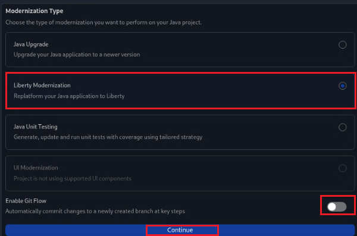</kbd>

        Click on **Continue**.

3. Upload and extract Migration plan

    Bob wants to read the AMA migration plan to better understand the modernization target and identified issues. The modernization plan will help to do the modernization in a more deterministic way. 
    1. Click on **Select File**

        <kbd></kbd>

    2. Click on **Downloads**, then select the migration plan and click on  **Select File**

        <kbd></kbd>

    3. Verify that the migration plan has been selected and click on  **Continue**

        <kbd></kbd>

    4. Bob extracts the migration plan and wants to save the embedded Liberty server configuration file **server.xml** as well as the **Containerfile**. Click on  **Approve once** for server.xml as well as for Containerfile.

        <kbd></kbd>

        <kbd>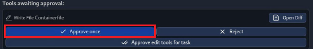</kbd>

    5. Bob has analyzed the AMA reports and knows which issues have been identified. As  next step, Bob wants to download the recipes for the automated fixes.
    Before applying the fixes, let's take a look at the application as is.
    **DO NOT CLICK** on **Approve once** yet.

        <kbd>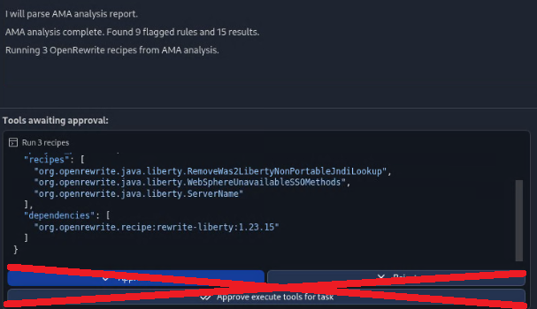</kbd>

4. Test the application on Liberty

    As the tool does a static analysis, it cannot detect if the identified issues really need to be fixed or are located in unused code.
    Therefore, before continuing with the modernization, let's try to run the unchanged traditional WAS application on Liberty.

    1. Open a new terminal in Bob

        <kbd>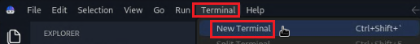</kbd>

    2. Configure Liberty to use Java 8. This is done via the Liberty configuration file **server.env**. Copy the following command into the terminal

            cd ~/Student/modresorts-project
            echo "JAVA_HOME=/usr/lib/jvm/ibm-semeru-open-8-jdk" >> src/main/liberty/config/server.env

        <kbd>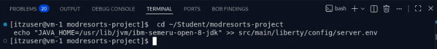</kbd>

        The file gets added to the Liberty configuration.

        <kbd>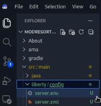</kbd>

    3. Expand the Liberty Dashboard and click on **Refresh**.

        <kbd>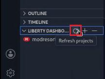</kbd>

    4. **Right-click** on **modresorts** and select **Start** to start the application on Liberty.

        <kbd>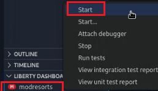</kbd>

    5. The application gets started. Wait until the server and the application have been started.

        <kbd>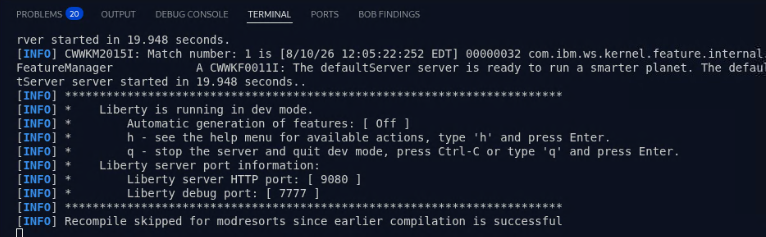</kbd>

    6. Open a browser window and access the application at the URL http://localhost:9080/resorts.

        <kbd>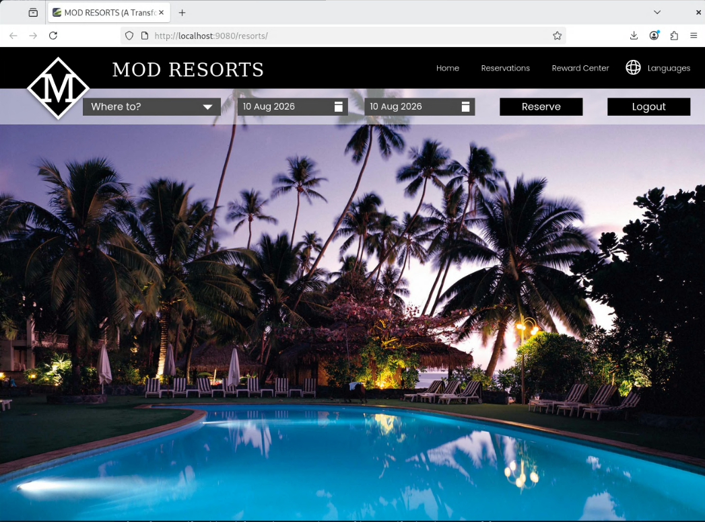</kbd>

        Click on **Where to** and select **Paris**. 

        (You might have to put the browser in full-screen to make the panel work.)

        <kbd>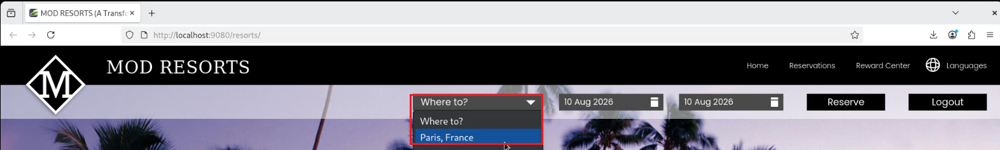</kbd>

        You should see some errors in the display of weather data.

        <kbd>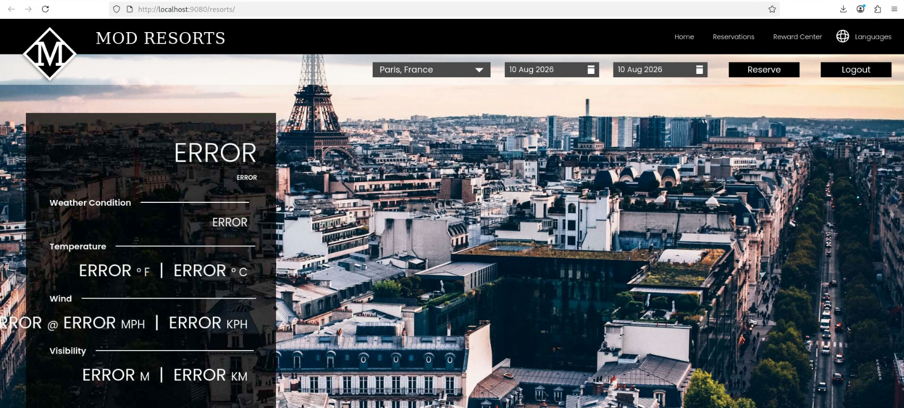</kbd>

        Switch to the IBM Bob IDE and you should see an error related to **Servername**.)

        <kbd>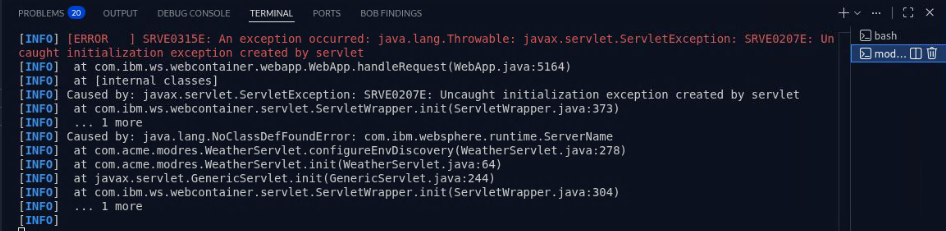</kbd>

        Switch back to the browser and click on **Logout**.

        <kbd>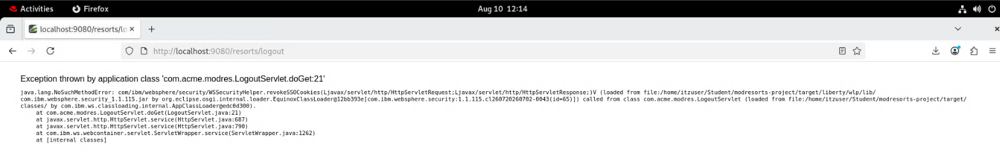</kbd>

        Switch to the Bob IDE and you should see an error related to **revokeSSOCookies**

        <kbd>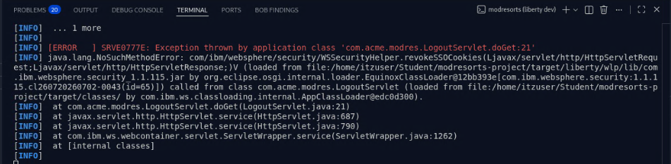</kbd>

        This confirms that the application as is cannot run on Liberty with Java 8.
    
    7. In the terminal press CTRL-C to stop the Liberty instance. 
        Make sure that the server gets stopped.

        <kbd>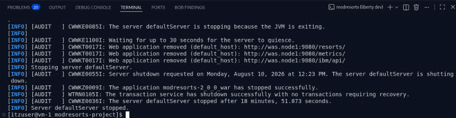</kbd>

5. Continue with the modernization wizard.

    1. Go back to the modernization wizard and click on **Approve once** to apply the automated fixes.

        <kbd>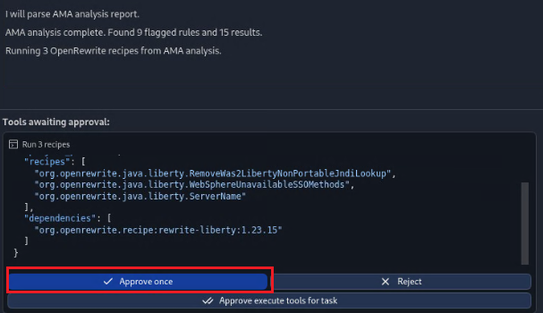</kbd>

    2. The recipes will be applied. Wait until the process has completed.

        <kbd></kbd>

    3. Click on **Recipes applied** to see more details.

        <kbd></kbd>

        You can see that the **LogoutServlet.java** and the **Weatherservlet.java** have been changed. 
    
    4. To better compare what has changed, switch to the **Source Control** view and compare the files. 5 files have been changed so far.

        - The files **server.xml** and **Containerfile** have been copied over from the migration plan.
        - The file **server.env** has been created to make Liberty use Java 8.
        - The files **LogoutServlet.java** and the **Weatherservlet.java** have been changed by the recipes. 
        
        Click on **LogoutServlet.java** to view the changes.
        <kbd></kbd>

    5. After reviewing the changes, close the comparison.

        <kbd></kbd>

3. Now that Bob resolved all issues with automated fixes via recipes, Bob will take a look at the remaining issues and will use agentic AI to resolve them.

    1. Fix the issues around **WebSphere Runtime APIs and SPIs**

        1. Bob wants to start a new subtask to fix the issues around the WebSphere Runtime APIs and SPIs.

            <kbd></kbd>

            Click on **Approve once** to continue. 

        2. Bob creates a subtask and a **Todo** list to fix the issue based on the recommendations from the AMA migration plan.

            <kbd>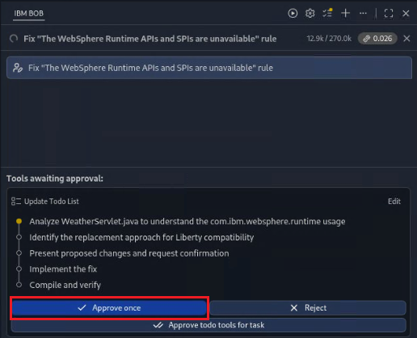</kbd>

            Review the Todo list (you could also edit it to add or remove steps). Finally, click on **Approve once** to continue. 

        3. Bob detects that the critical code no longer exists in the WeatherServlet. It wants to review the changes in git to understand why.

            <kbd>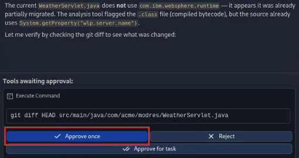</kbd>

            Click on **Approve once** to continue. 

        4. Bob verified that the code was already changed (by the recipes), so no further action is required. Therefore, Bob wants to update the Todo list.

            <kbd>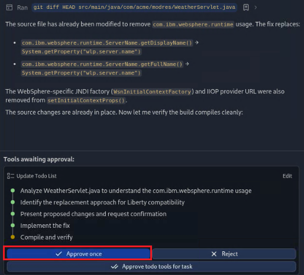</kbd>

            Click on **Approve once** to continue. 
    
        5. Bob wants to execute the command "mvn compile". 

            <kbd></kbd>

            Click on **Approve once** to continue. 

        6. Bob wants to update the Todo list.

            <kbd>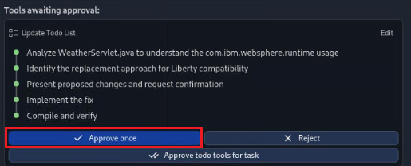</kbd>

            Click on **Approve once** to continue. 

        7. Bob wants to complete the subtask.

            <kbd></kbd>

            Click on **Approve once** to continue. 

        8. Bob has created the summary what has been done in the subtask.
            You can expand the section to see the details.

            <kbd>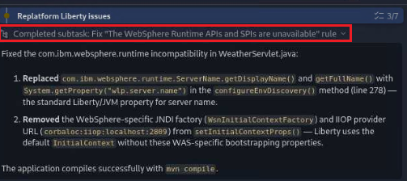</kbd>

    2. Fix the issues around **WebSphere Servlet API**

        1. Bob wants to start a new subtask to fix the issues around the WebSphere Servlet API. 

            <kbd>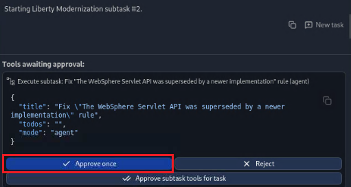</kbd>

            Click on **Approve once** to get continue. 

        2. Bob creates a subtask and a Todo list  to fix the issue based on the recommendations from the AMA migration plan.

            <kbd>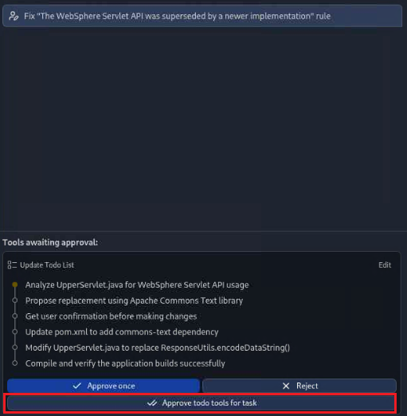</kbd>

            Review the Todo list (you could also edit it if needed). 
            To reduce the number of approvals, you can allow Bob to update the Todo list for the subtask without approval. 
            Click on **Approve todo tools for task** to continue. 

        3. Bob explains the issue and proposes a solution based on **Apache Commons**.

            <kbd>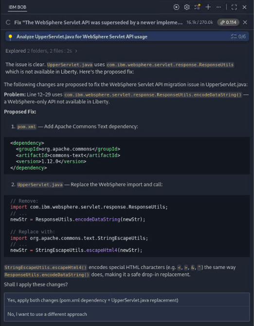</kbd>

            You can select to apply the recommended changes or to use a different approach. Let's see which different approaches are available.

            Enter in the chat window the following text to get alternatives:

                What are the alternatives?

            <kbd>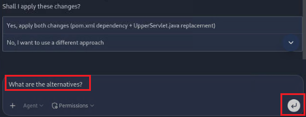</kbd>

            Then press ENTER or click the icon.    

        4. Bob comes back with a list of different alternatives.

            <kbd></kbd>

            Your list of alternatives might look different; Bob might also decide to display the alternatives as list instead of a table.

            Select **Apache Commons** by clicking on the related field.

        5. Bob wants to edit the pom.xml.

            <kbd>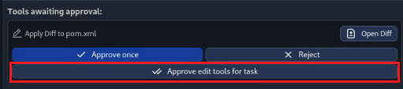</kbd>

            To reduce the number of approvals for the task, click on **Approve edit tools for task** to continue. 
    
        6. Bob wants to execute the command "mvn compile". 

            <kbd></kbd>

            Click on **Approve for task** to continue. 

        7. Bob wants to complete the subtask.

            <kbd></kbd>

            Click on **Approve once** to continue. 

        8. Bob has created the summary what has been done in the subtask.
            You can expand the section to see the details.

            <kbd></kbd>

    3. Bob has completed the tasks related to **Replatform Liberty issues**. Let's review the performed tasks and validate the changes.
    
        1. Review what has been done so far:
    
            <kbd></kbd>

    
        2. The next step is to deploy and validate.

            <kbd>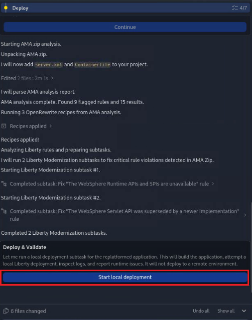</kbd>

            Click on **Start local deployment**.

        3. Bob will ask for permission to start the **Deploy** subtask.

            <kbd>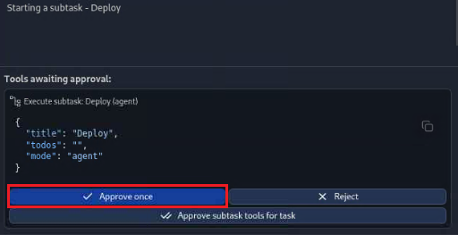</kbd>

            Click on **Approve once** to continue. 

        4. Bob will ask for permission to build the application.

            <kbd>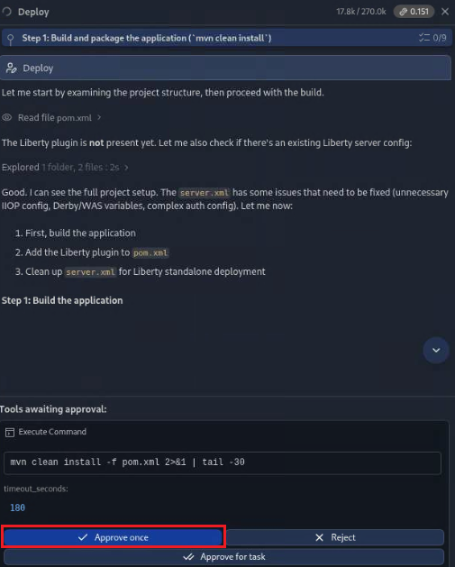</kbd>

            Click on **Approve once** to continue. 

        5. Bob rebuilt the application and will ask again for permission to install the application.

            <kbd>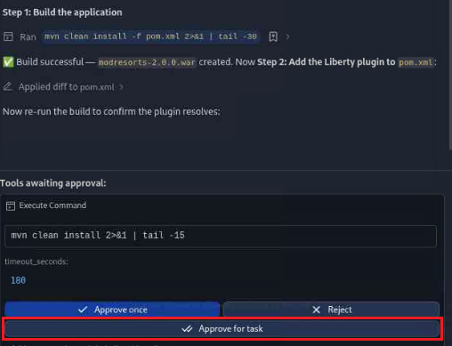</kbd>

            Click on **Approve for task** to continue. 

        6. Bob wants to clean up the Liberty installation.

            <kbd>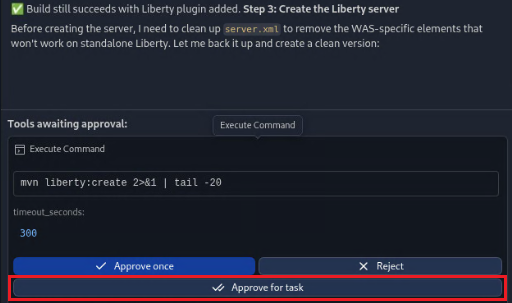</kbd>

            Click on **Approve for task** to continue. 
        
        7. Bob wants to install the required Liberty features.

            <kbd>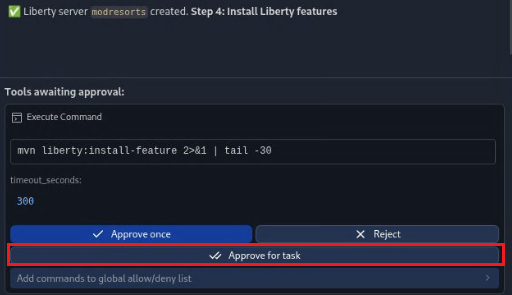</kbd>

            Click on **Approve for task** to continue. 
        
        8. Bob wants to backup the server configuration and adjust it.

            <kbd></kbd>

            Click on **Approve for task** to continue. 

        9. Bob wants to deploy the application.

            <kbd>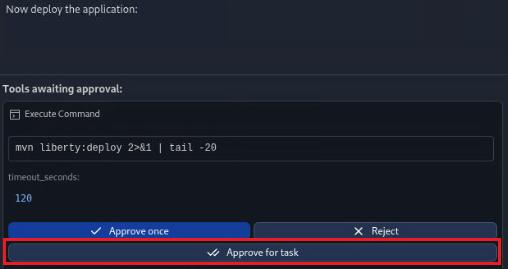</kbd>

            Click on **Approve for task** to continue. 

        10. Bob wants to start the Liberty instance.

            <kbd></kbd>

            Click on **Approve for task** to continue. 

        11. Bob started Liberty and the application, analyzed the logs and detected some configuration issues. Therefore, Bob wants to stop the Liberty instance to clean up the Liberty configuration.

            <kbd>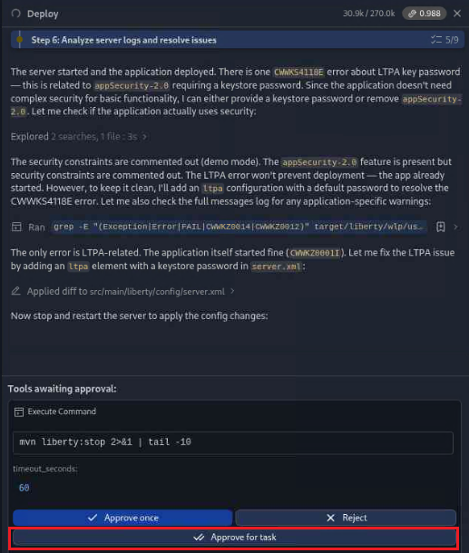</kbd>

            Click on **Approve for task** to continue. 

        12. Bob started Liberty again and did some reconfiguration using Liberty hot-reloading. Now Bob wants to test the endpoints via curl:

            <kbd>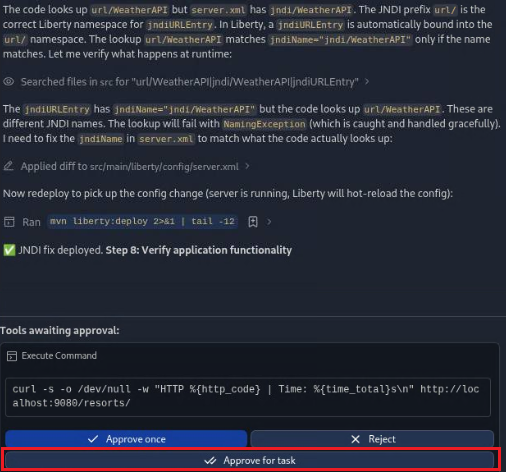</kbd>

            Click on **Approve for task** to continue. 

        13. Bob tested the first endpoint successfully and wants to test additional endpoints via curl:
        
            <kbd>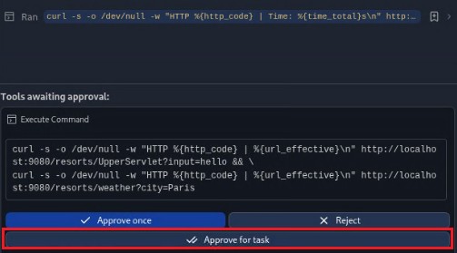</kbd>

            Click on **Approve for task** to continue. 

        14. Bob tested additional endpoints successfully and wants to test additional endpoints via curl:
        
            <kbd>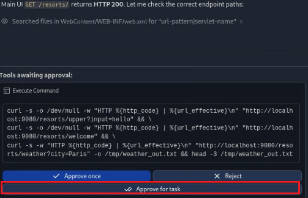</kbd>

            Click on **Approve for task** to continue. 

        15. Bob tested additional endpoints successfully and got some errors. Therefore, Bob wants to test additional endpoints via curl:
        
            <kbd>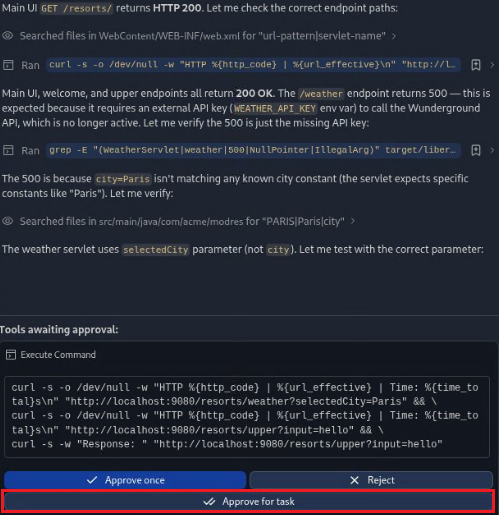</kbd>

            Click on **Approve for task** to continue. 

        16. Bob tested all endpoints successfully. Now it asks you to review the logs. 
        
            <kbd>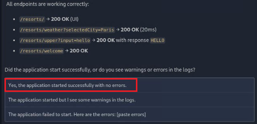</kbd>

            Feel free to do so, you can find the log here: 
            **Explorer > target/liberty/wlp/usr/servers/modresorts/logs/messages.log**
        
            Then click on **Yes, the application started successfully with no errors** to continue. 

        17. Bob wants to complete the subtask. 
        
            <kbd></kbd>

            Click on **Approve for task** to continue. 

        18. Bob created a summary with a diagram visualizing the performed tasks. 
        
            <kbd></kbd>

            Click on the diagram to expand the diagram. 

            <kbd>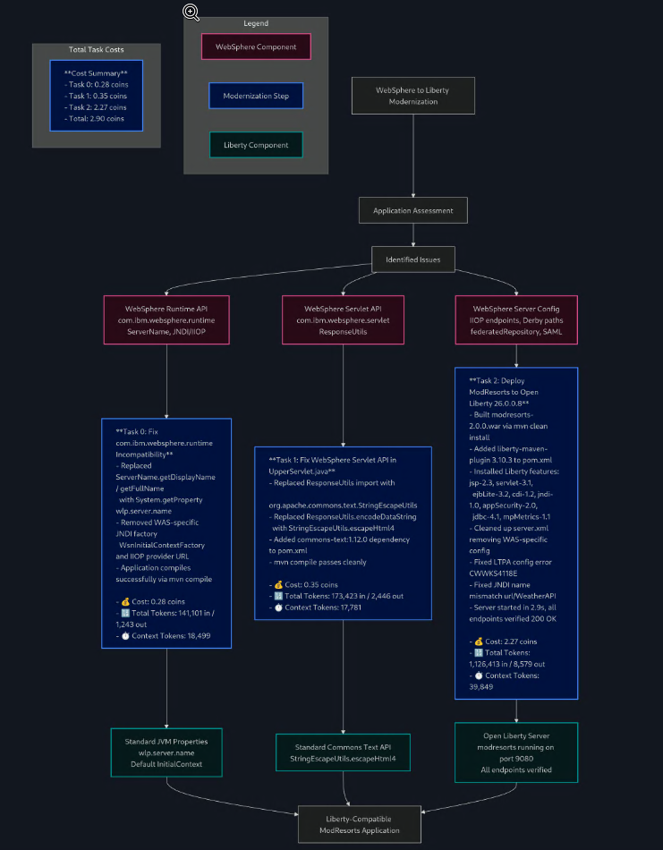</kbd>

            As you can see, the diagram contains details about the performed modernization as well as details about the costs and tokens for the different tasks.

            
        19. Open the browser and test the application to verify, that the initial issues are resolved. 
        
            In the browser, open the URL http://localhost:9080/resorts.
            Then navigate to **Where To > Paris** to verify that the error is gone. Do the same with the **Logout** button. 

        20. Switch back to Bob and ask Bob to stop the Liberty instance.

                Stop Liberty

            <kbd></kbd>

            Wait until the Liberty instance has stopped.

4. Adjust the auto-approval permissions

    Permissions are used to define what Bob is allowed to do without asking. Initially you set the permissions to **Read** only. 

    1. Review the permissions for the task
        
        Click on **Permissions** to see what has been enabled:

        <kbd>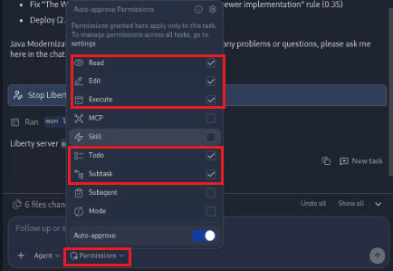</kbd>

        In the last part of the lab, you clicked several times on **Approve for task**. This is reflected in the task permissions.
    
    2. Adjust the permissions overall

        Task permissions are only valid for the current task. But typically, there are some permissions that you want to approve for any project and task. These are defined in the **Bob Settings**.

        Click in the Bob panel on **Settings**.

        <kbd>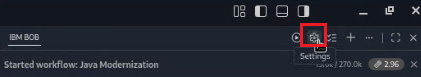</kbd>

        Click on **Chat** to see the details about auto approvals:

        <kbd>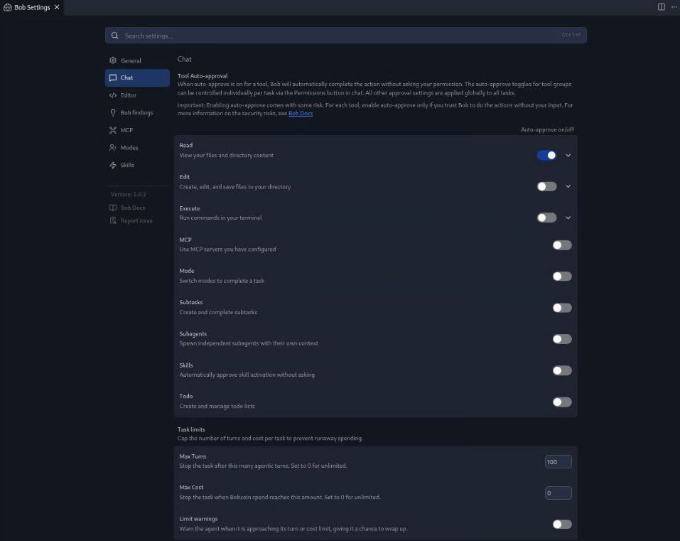</kbd>

        Expand the section **Execute** to see all allowed and denied commands:

        <kbd>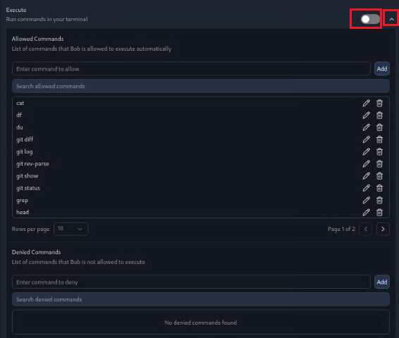</kbd>

        As you can see, the auto-approval for **Execute** is not enabled so far. Feel free to enable it.
        
        In the section, you could also add commands like **curl**, **mvn clean** and so on that you want to auto-approve.

        Close the section for **Execute**.

        Scroll down to the **Workspace sandbox** settings and you can see that the read and write files is only allowed within the workspace even if auto-approval for **Read** or **Edit** is enabled. 

        <kbd>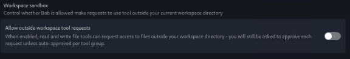</kbd>

        This makes sure that Bob cannot access files outside the workspace unintended.

        You can also define task limits to make sure Bob does not consume all coins for example.

        <kbd>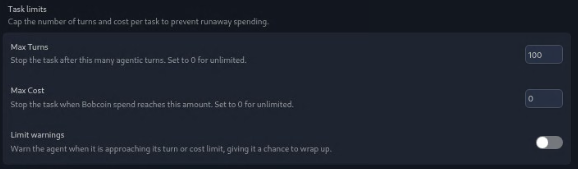</kbd>

        For the next part of the lab, adjust the Chat settings to this: 

        <kbd>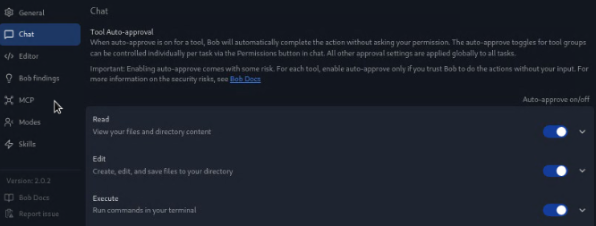</kbd>

    
        Finally, set the **Bob Settings** panel

        <kbd></kbd>
    

### 7.3 Perform a Java upgrade using IBM Bob

Now let's take a look at the Java Upgrade workflow.

1. Start the Java Upgrade Workflow

    1. Switch to the **Bob** panel, click on the **Workflow** icon, expand **Java Modernization** and click on **Start**.
    
        <kbd>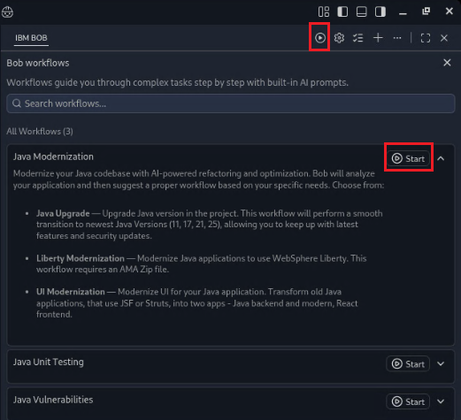</kbd>

    2. Bob wants to analyze the project to identify which modernization workflows make sense.

        <kbd>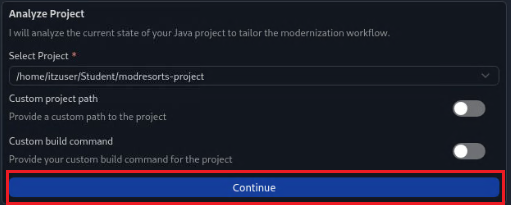</kbd>

        Click on **Continue**.

    3. Bob offers different **Modernization Types**. As you can see, **Liberty Modernization** is disabled. This is because Bob identified the project as Liberty project. Select **Java Upgrade** and **Disable Git Flow**.
    
        <kbd>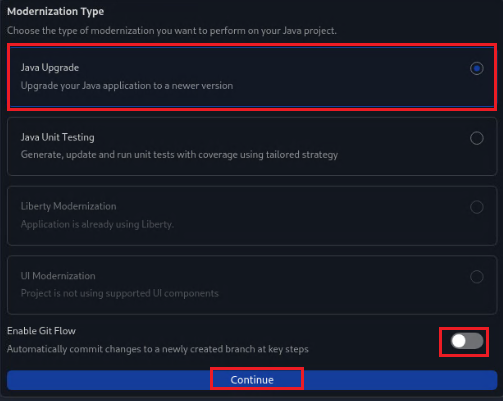</kbd>
    
    Click on **Continue**.

    4. Bob wants to check if sdkman is available which is required for the workflow.
    
        <kbd>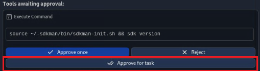</kbd>
    
        Click on **Approve for task**.

    5. Select the target Java and Jakarta EE.

        As Semeru 21 is installed, select as shown in the screenshot.
    
        <kbd>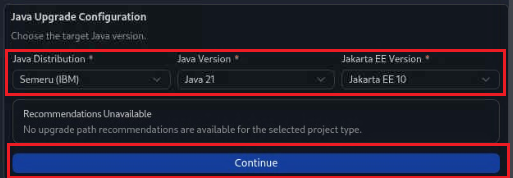</kbd>    

        Also take a look at the **Description** and **Key Technical Challenges.** Finally, click on **Continue**.

2. Let Bob fix the Java Upgrade issues

    1. Bob runs some recipes to modernize the Java project. As Bob found some issues, Bob wants to start a sub-task to fix them

        <kbd>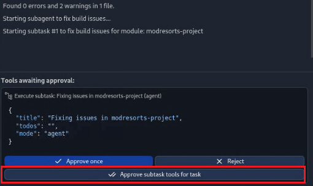</kbd>
    
        Click on **Approve subtask tools for task**.

    2. Bob fixed the issues and found some vulnerabilities. Expand the **Vulnerability** section to see the details.

        <kbd>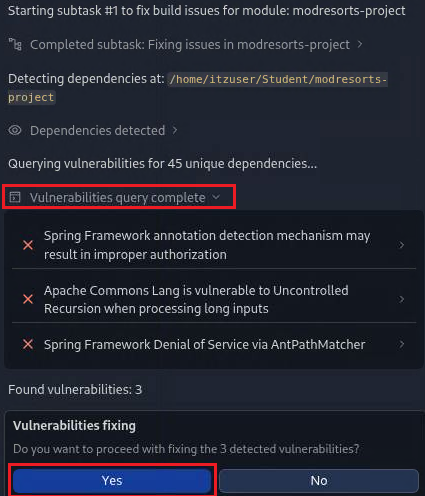</kbd>
    
        Click on **Yes** to continue.

    3. Bob creates a **Todo** list

        <kbd>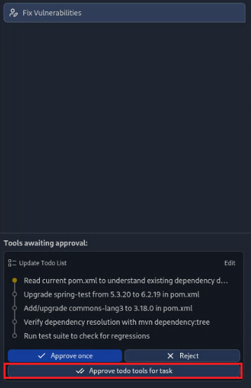</kbd>
    
        Click on **Approve todo for task**.

    4. Bob wants to check the dependency tree for the frameworks:

        <kbd>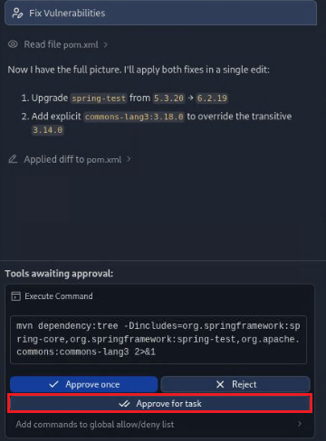</kbd>
    
        Click on **Approve for task**.

    5. Bob fixed the issues and wants to review the resolved dependencies:

        <kbd>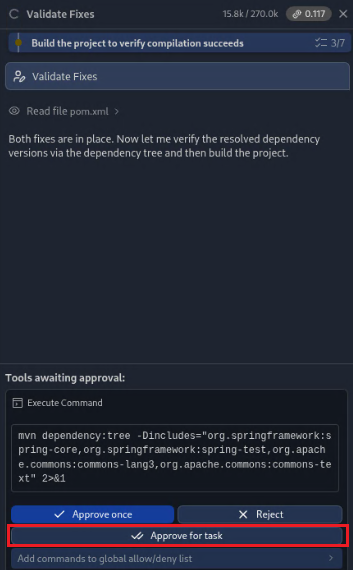</kbd>
    
        Click on **Approve for task**.

    6. Bob want to build the application finally:

        <kbd>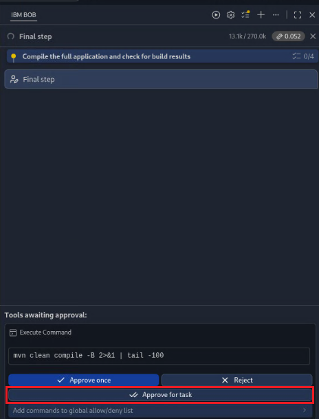</kbd>
    
        Click on **Approve for task**.

3. Review Java Upgrade Summary

    1. Bob completed the Java upgrade and created a summary with the costs of the migration and a migration diagram:

        <kbd>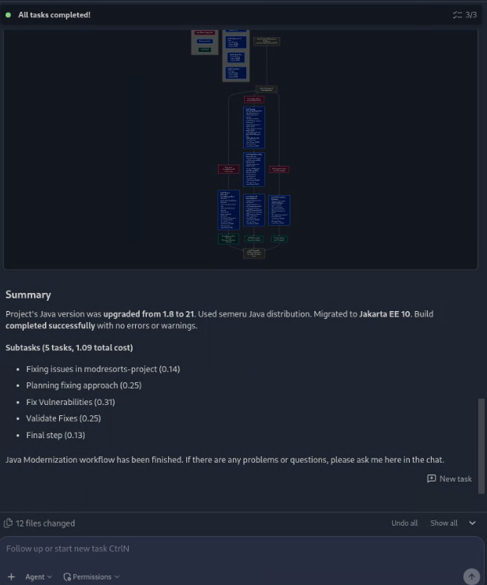</kbd>
     
        Click on **Migration Diagram** to expand it.

    2. Bob completed the Java upgrade and created a summary including Migration Diagram:

        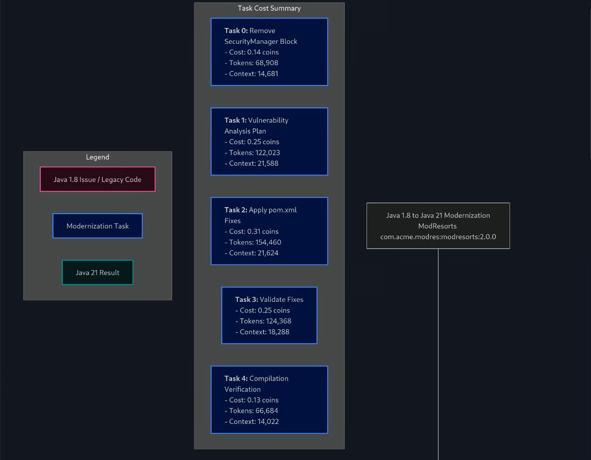
        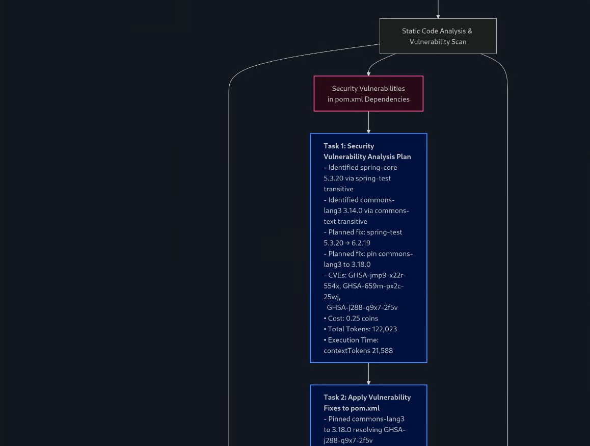
        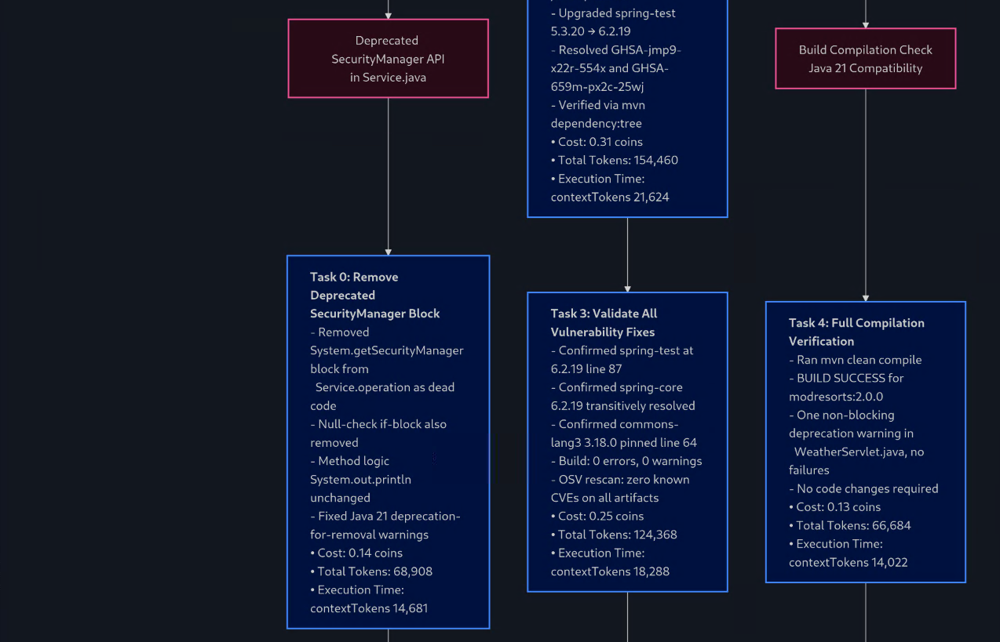
    
    Your flow might look slightly different.
     
4. Optionally test the application with Java 21

    1. If you would start Liberty right now, it would start with Java 8 as this has been specified in the server.env file. 

        <kbd>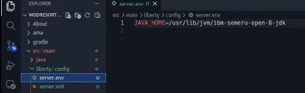</kbd>
    
        Set the line in comment and save the file

        <kbd>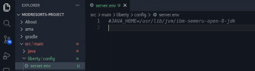</kbd>
    
    2. Ask Bob to update the Liberty server configuration:

            Update the Liberty server configuration to fit to the updated application

        If required, you might have to approve a task.

        <kbd>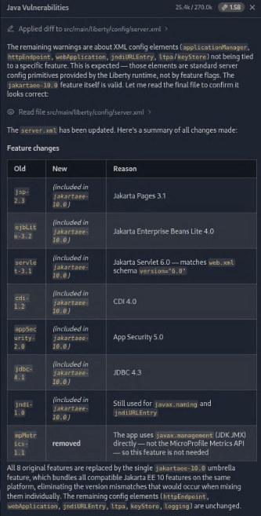</kbd>

        
    3. Use the Liberty Dashboard to start Liberty
        (Right-click on modresorts)

        <kbd>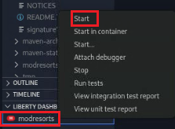</kbd>
        
    4. Open in the browser the URL http://localhost:9080/resorts.
    
    5. Click on **Where to?** and switch to Paris or another city. 
    (If the button does not work, make sure that the browser is in full-screen.)

    <kbd>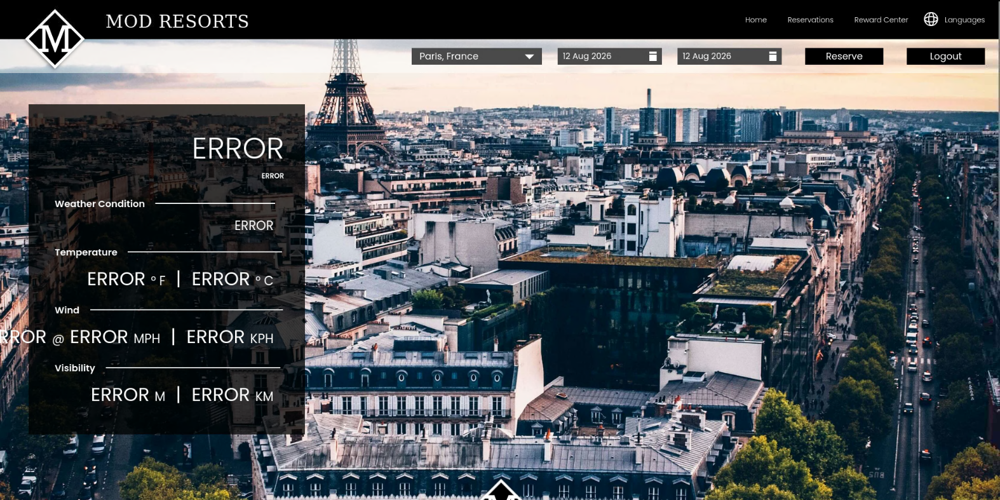</kbd>

    If you see an error as in the screenshot above, take a look at the logs

    <kbd>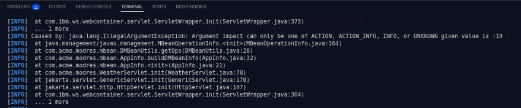</kbd>

    Stop the Liberty instance using the Liberty Dashboard or CTRL-C in the terminal. 

    Ask Bob to fix the issue by copying the error message into the Bob chat.

    <kbd>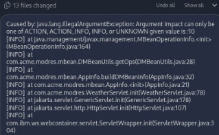</kbd>

    Approve required tasks.

    Finally, Bob compiles the fixes application

    <kbd>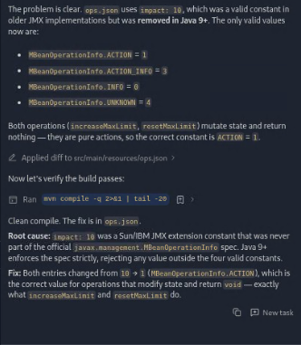</kbd>

    Start Liberty via Liberty Dashboard or via terminal (mvn liberty:run).

    Finally, test the application again in the browser. Click on **Where to?** and switch to Paris should no longer return an error.

    <kbd>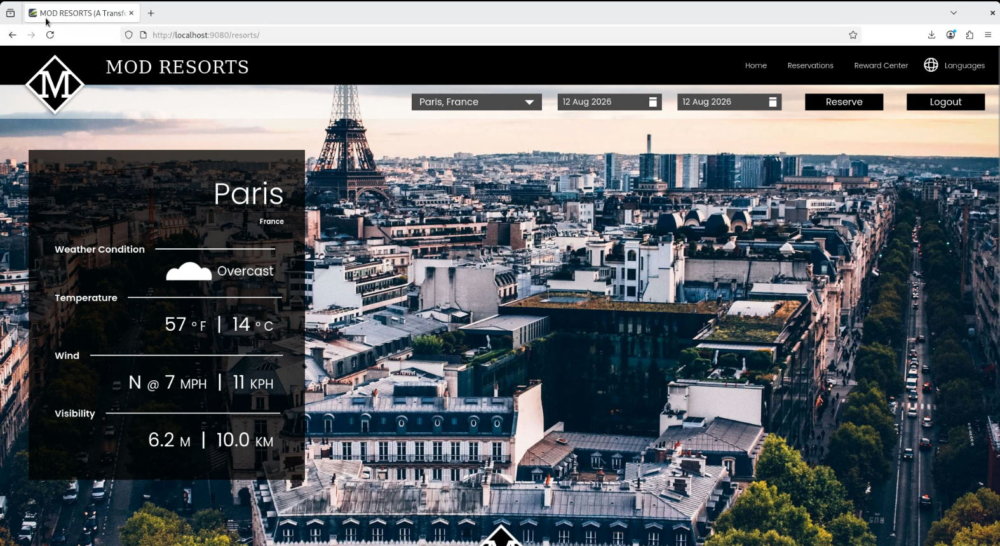</kbd>

This concludes the lab around Java Modernization. 

You should now have a good understanding how IBM Bob can help to modernize your applications. 

### 7.4 Recap

Congratulations, you have finished the application modernization part.

**Let’s recap what you did so far.** 

- You tested the unchanged application on Liberty to validate that the identified issues cause runtime errors and need to be fixed.
- You used the IBM Bob to apply automated fixes via fixes
- You used the IBM Bob to apply agentic AI to fix the remaining issues. 
- You tested successfully the modernized application on Liberty
- You got an idea how to use IBM Bob to upgrade the Java SE or Java EE level of the application.
- You also should have a good understanding how to use Bob for troubleshooting migration issues.

## 8 Lab Cleanup

1. Once you are done, make sure that Liberty and Visual Studio Code is not running.

2. Delete the Student folder via command:

        rm -rf ~/Student

3. Close the browser and all terminal windows

## Summary

In this lab, you learned how to assess a WebSphere application using IBM Application Modernization Accelerator. In addition, you learned how to use the AMA Dev Tools to apply automated fixes and resolve other issues.

**Congratulations!**

**You have successfully completed the lab "Application Modernization Accelerator"**

# Appendix

Additional Information

## 5. Explore Application Modernization Accelerator

### 5.2 Access the AMA User Interface

To explore the AMA User Interface, you will create a workspace with sample data. A workspace is a designated area that will house the migration recommendations provided by AMA for existing applications and/or environments. You can name and organize these however you want, whether it’s by business application, location, or teams.
Later on, you will create another workspace for the WebSphere landscape used in this lab environment.

1. Access the AMA UI and create a workspace with sample applications.
    1. Open a browser window by clicking on **Activities** and then select the **Firefox** browser icon.

        <kbd></kbd>

    2. Access the AMA User Interface via the URL https://localhost:3000

        If you get a warning, that there is a potential security risk, click on **Advanced** and then **Accept the Risk and Continue**. 

        <kbd></kbd>
    
        Finally, you should see the Application Modernization Overview Screen.

        <kbd></kbd>
    
        Click the button to **Accept all** to accept all cookies.
        An introduction wizard is displayed.

        <kbd></kbd>
    
        Click through the wizard and finally close it.
        Your screen should now look like this:

        <kbd>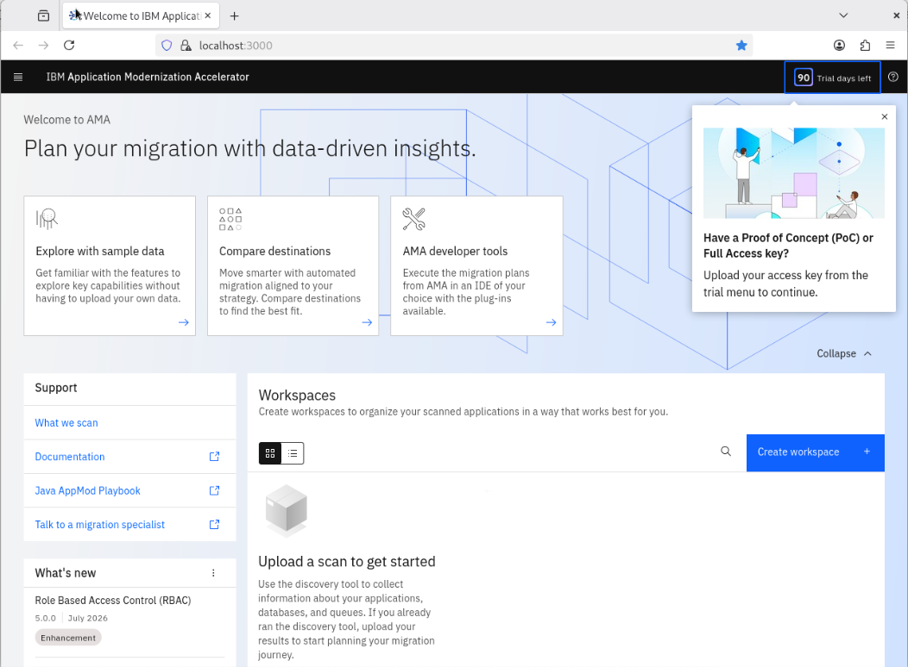</kbd>
    

    3. Click on the button **Create workspace** and enter **Sample_Data**, select **include sample data**, then click on **Create**.

        <kbd>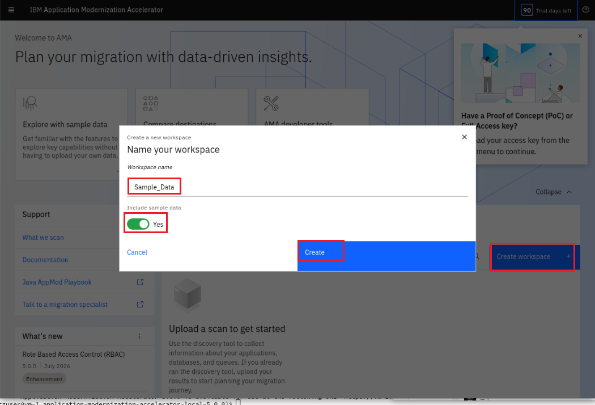</kbd>
    
    4. The workspace will be created.
        <kbd>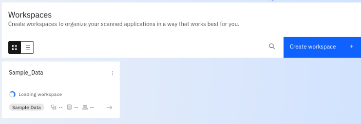</kbd>
    
    5. Wait until the workspace has been created which can take a minute or so. Finally, you will see that the workspace has been created and contains 29 sample applications, 7 databases and 9 queues.
        <kbd>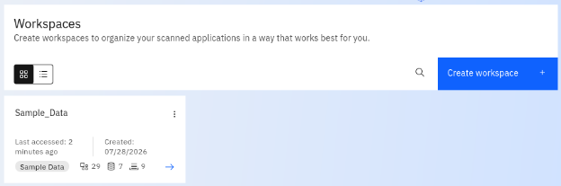</kbd>
    
2. Explore the workspace with the sample applications

    1. Click on the workspace to open it.

    2. AMA supports three destinations, **Liberty**, **MoRE** and **WebSphere Application Server** (Traditional)
    
        <kbd>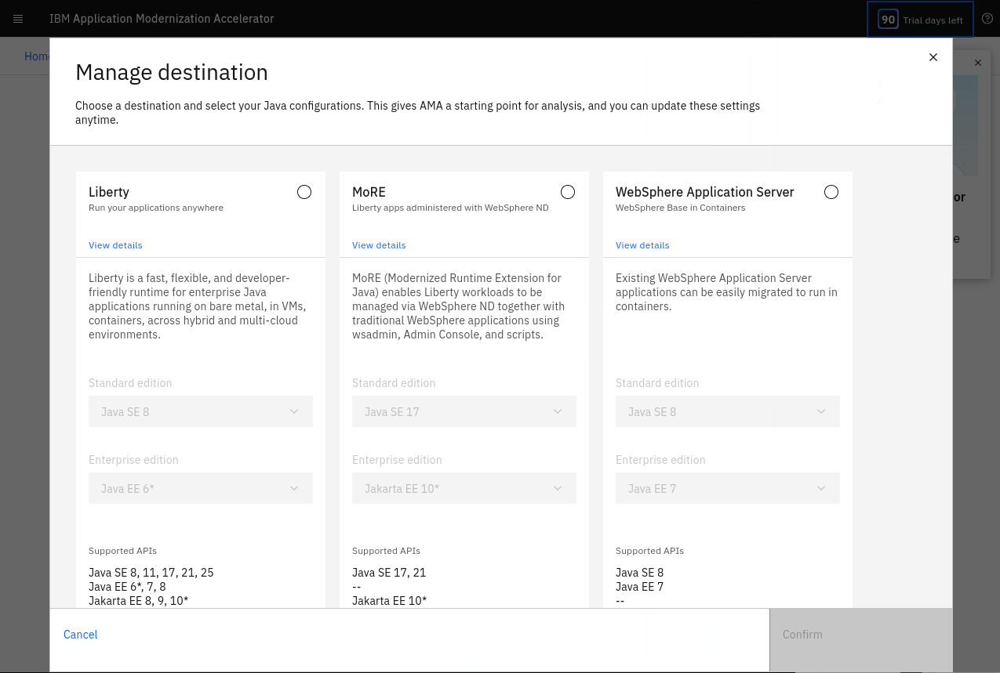</kbd>
    
    3. Select **Liberty** as destination and click on **Confirm**.
    
        <kbd></kbd>
    

    4. The **Visualization** panel shows all applications and how they relate to each other regarding common databases or queues.

        As this is a AMA trial version, a pop-up will be shown in the upper right. Close the pop-up.

        <kbd></kbd>

        Now zoom in to see the application names.

        <kbd></kbd>
    
        You can filter by name to see only specific applications and dependencies. (For example, filter for the application ACME.)

        <kbd>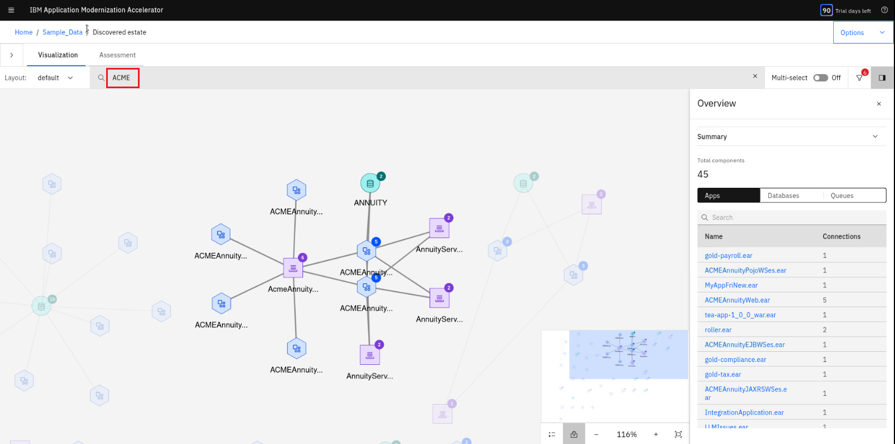</kbd>
    
        You can also filter by library to see only specific applications and dependencies. (For example, filter for Spring libraries.)

        <kbd></kbd>
    
    As you can see in the screenshot above, the visualization provides insight which applications share the same database or queue which helps to shape your migration strategy.

    5. Switch to the **Assessment** tab 

        <kbd></kbd>
    
        The assessment tab provides insight into the different applications.
        <kbd></kbd>
    
    6. Take a look at the upper part

        <kbd></kbd>

        - Under **Applications**, you can change the destination including the Java SE and Java EE level.
        - Under **Total Applications**, you can see the effort for the chosen target. AMA also analyzes all the application code and common code that is shared across applications and provides an estimated total cost for migrating the apps and common code in the workspace. 
        
        Total cost is the number of days of development cost to migrate that code to run on the selected migration target. In this example, WebSphere Liberty is the selected migration target.

    7. Change the Java SE Level and the Java EE level to find out how the overall effort changes. As you can see the estimated efforts change.

        <kbd></kbd>

        Finally, change the Java SE and Java EE level back to the minimum to see the efforts for the quickest path of modernization.

    8. Take a look further down at the application list.

        <kbd></kbd>
    
        The “All Java applications” page also shows the application summary analysis results for all the apps from the AppSrv01 profile for each of the selected migration targets.

        For each app / migration target combination, you can see these results:

        - Java application
        - Collection / Profile name
        - Complexity
        - Issues
        - Required code changes
        - Application cost (in days)
        - Migration plan

        The following details are included in the summary table (this is the per-application view):

        - Application Name: The name of the EAR/WAR file found on the application server.

        - Collection/Profile: Collection represents the hostname of the machine where the application resides. The profile represents the profile name in the application server where the application is installed.

        - Complexity: Indicates how complex Transformation Advisor considers this application to be if you were to migrate it to the cloud.

        - Issues: The number and severity of potential issues with the migration of the application.

        - Required code changes: Indicates the type of code change needed.

        - Application cost in days: Provides an estimate in days for the development effort to perform the migration for just this application. Cost estimates calculated by Transformation Advisor are high-level estimates only and may vary widely based on skills and other factors not considered by the tool.

        - Migration plan: accelerator files generated by Transformation advisor to aide in building and deploying the selected application to the target runtime.

    9. Feel free to expand the one or other app to see more details about an application.
        <kbd>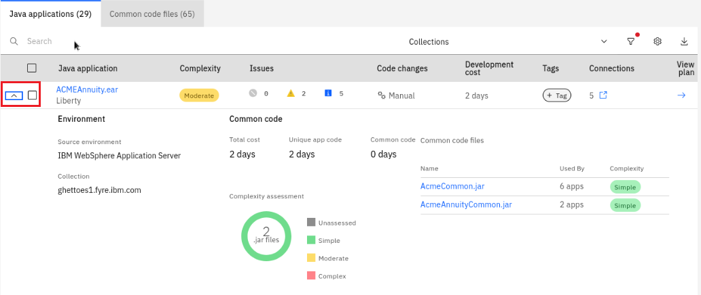</kbd>
    

### 5.3 Explore the AMA APIs
Application Modernization Accelerator (AMA) also provides Swagger interfaces to access some of the data via APIs.

1. Open a browser and enter the following URL:
    https://localhost:2220/openapi/ui/

    If you get a warning, that there is a potential security risk, click on **Advanced** and then **Accept the Risk and Continue**. 

    <kbd>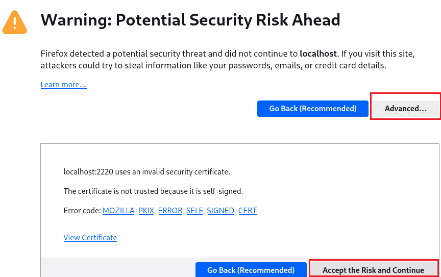</kbd>

    Finally, the Swagger UI opens:

    <kbd>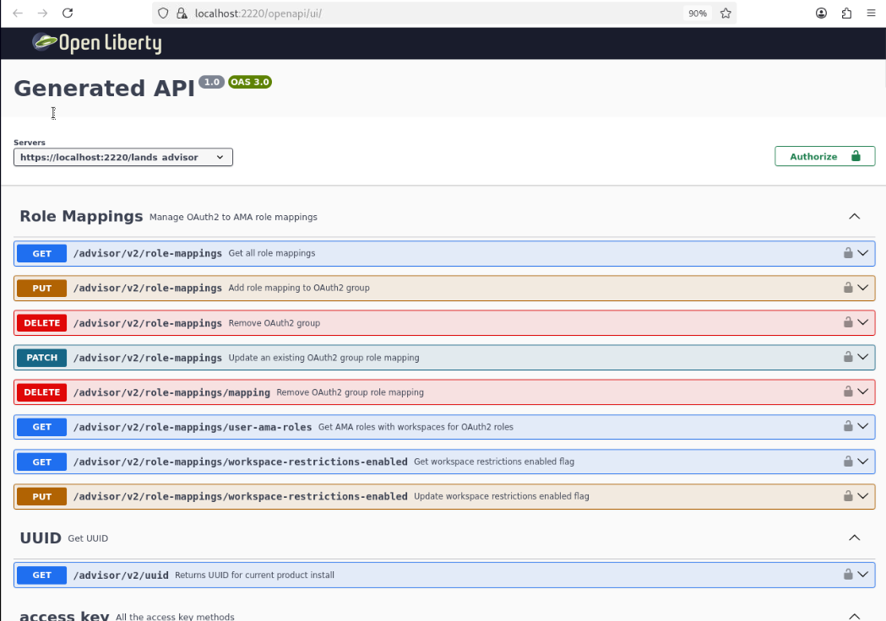</kbd>

2. Look at the different APIs which allow to create a new workspace, upload a data collection or bulk, upload the license key and much more.

    Scroll down to the section **collection archives**.
    <kbd>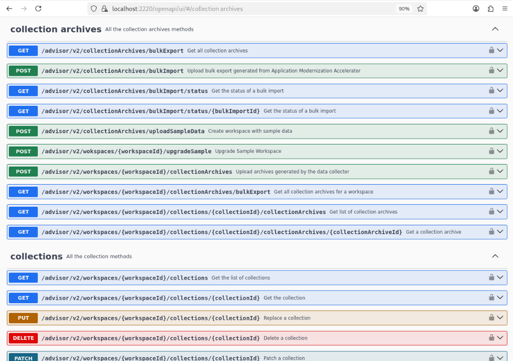</kbd>

    To create for example the demo workspace which you just created manually, you could use the **uploadSampleData** API via the following command:

        curl -k -X 'POST' \
        'https://localhost:2220/lands_advisor/advisor/v2/collectionArchives/uploadSampleData' \
          -H 'accept: */*' \
          -H 'locale: en' \
          -H 'workspaceName: Sample_Data' \
          -d ''

3. Close the browser window with the Swagger UI.

 
Right now, you just explored the capabilities of AMA based on sample data. In the next section, you will analyze the modresorts application to identify the efforts to migrate it from traditional WAS to Liberty. You will use the AMA Discovery tool to gather the data collection from an existing WebSphere installation and perform some analysis.
Then you will use the AMA Dev Tools to make the required code changes.

#### 6.5.2 Assess the applications using the AMA PoC key
Now let's apply an AMA Access Key so that you get access to the analysis details and the migration plan. 

This section explains how to apply the access key via AMA User Interface. You could also run the following command to apply the key:

        sh ~/software/AMA/AMA_apply_PoC_Key.sh 

**Apply the AMA access key via User Interface**

1. Click on **Trial days left** on the top of the page

    <kbd>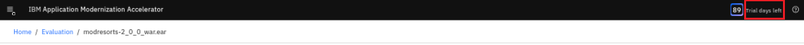</kbd>

2. In the pop-up, click on **Upload access key**

    <kbd>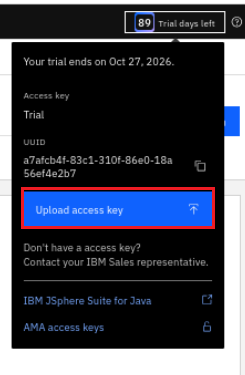</kbd>

3. Click on **click to upload**

    <kbd>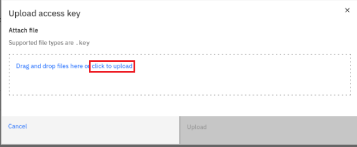</kbd>

4. Navigate to **home > itzuser > software > AMA** and select the AMA key file, then cick on **Open**,

    <kbd>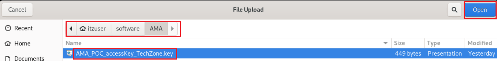</kbd>

5. Click on **Upload**

    <kbd>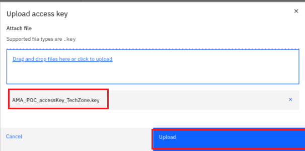</kbd>

6. The PoC wizard will be shown. Feel free to walk through the wizard, then close it.

    <kbd></kbd>

    As you can see, the display on the top right now switched to **Proof of Concept** and shows that there are 3 applications remaining. This means that you got access to analyze 3 applications.

    <kbd></kbd>

7. The next step is to add the **modresorts** application to the PoC.   Click on **Add to PoC**

    <kbd></kbd>

8. You will be asked to confirm that you want to **modresorts** application to the PoC. Click on **Confirm**.

    <kbd></kbd>

9. As you can see, the application has been added to the PoC and the migration plan has been unlocked.

    <kbd></kbd>

    Before we will go to the migration plan, we will take a look at some other unlocked capabilities.

10. Take a look at the left and you can see that the **Analysis report** has been unlocked.

    <kbd></kbd>

    Feel free to look into the report.

11. Scroll down to the section **Issues**. 

    Under **Unique Code Issues**, expand the list of **Technology issues**.

    <kbd></kbd>

    Expand any of the 5 issues and you can get more details about the issue, recommended changes and which code is impacted. 

    <kbd></kbd>
    
    **This capability is not available with the trial access key.**

